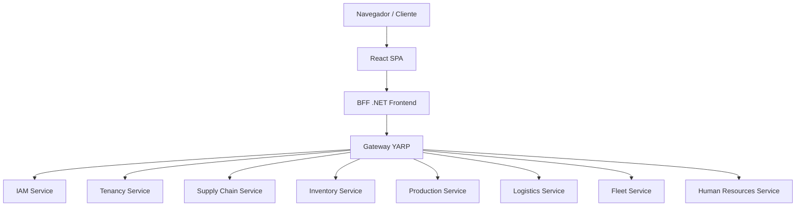

# 🚂 Rail-Factory: Monorepo Industrial

<div align="center">
  
  [](https://dotnet.microsoft.com/)
  [](https://react.dev/)
  [](https://vitejs.dev/)
  [](https://www.docker.com/)
  [](https://www.rabbitmq.com/)
  [](https://www.postgresql.org/)
  
  **Um Sistema de Gestão Industrial (MES/WMS/ERP) Multitenant, Modular e Distribuído com Arquitetura Hexagonal.**
</div>

---

## 📖 Visão Geral

O **Rail-Factory** é um monorepo industrial moderno projetado para orquestrar e monitorar todas as etapas de uma operação manufatureira. O projeto utiliza as tecnologias mais recentes do ecossistema `.NET 9` (com **.NET Aspire** para orquestração local de infraestrutura e serviços) e um frontend robusto em **React (Vite, TypeScript)** integrado via padrão **BFF (Backend for Frontend)**.

Toda a lógica de negócios é isolada por meio de **Arquitetura Hexagonal (Ports & Adapters)**, garantindo que o núcleo do sistema permaneça independente de detalhes de infraestrutura. O isolamento de dados é garantido através de uma estratégia rígida de **Banco de Dados por Tenant (Multitenancy físico)**.

---

## 🏗️ Arquitetura e Fluxo de Dados

A arquitetura do sistema é desenhada para alta escalabilidade e isolamento completo entre os domínios:



### Detalhes de Integração por Eventos (RabbitMQ)
Mudanças de estado críticas cruzam as fronteiras do domínio de forma assíncrona e resiliente através de eventos integrados com **Outbox Pattern** e fila de mensagens via **RabbitMQ**:

*   **Supply Chain**: Ao conferir um item, emite `supply.receipt_item_conferred` para creditar o saldo no inventário.
*   **Production**: Ao liberar uma OP, emite `production.stock_reservation_requested` para reservar componentes do estoque.
*   **Logistics**: Ao expedir um despacho, emite `logistics.shipment_dispatched` para debitar os saldos pelo método FIFO.

---

## 📦 Módulos do Sistema

O sistema é dividido em microsserviços especializados, cada um com seu banco de dados isolado por inquilino:

1.  🔑 **IAM (Identity & Access Management)**: Autenticação via Google SSO, gestão de papéis (RBAC) e auditoria de ações imutável.
2.  🏢 **Tenancy**: Resolução dinâmica de inquilinos e connection strings de banco de dados física e isolada.
3.  🌾 **Supply Chain**: Entrada de materiais via importação de XML de NF-e, mapeamento dinâmico de SKU de fornecedor para SKU interno e fluxo de conferência cega.
4.  🎒 **Inventory**: Saldo de materiais dividido em estados (`Available`, `Blocked`, `Reserved`), ledger transacional e baixa de estoque utilizando FIFO.
5.  ⚙️ **Production**: Cadastro de Work Centers, Bill of Materials (BOM) versionadas com suporte a perda técnica, lote padrão, custo teórico e ordens de produção com controle de consumo, scrap e qualidade.
6.  👥 **Human Resources (HR)**: Cadastro de funcionários, proficiência de habilidades (Skill Matrix) e apontamento de horas.
7.  🚚 **Fleet (Frota)**: Controle de veículos, alocação de motoristas, planos de manutenção preventiva e registros de abastecimento.
8.  📦 **Logistics (Logística)**: Gestão de transportadoras com suporte a Webhooks para eventos externos, ordens de expedição, cálculo de frete volumétrico/peso e rastreamento público de despachos.

---

## 🛠️ Tecnologias Utilizadas

### Backend
*   **Plataforma**: .NET 9 C#
*   **Orquestrador de Recursos**: .NET Aspire
*   **API Gateway**: YARP (Yet Another Reverse Proxy) com roteamento inteligente de tenants.
*   **Banco de Dados**: PostgreSQL com EF Core (Entity Framework Core) e Migrations dinâmicas por banco.
*   **Mensageria**: RabbitMQ com suporte a DLX (Dead Letter Exchange) e consumo resiliente.
*   **Caching**: Redis
*   **Testes**: xUnit, FluentAssertions e SQLite em memória para testes de inicialização.

### Frontend
*   **Framework**: React (com TypeScript e Vite)
*   **Biblioteca de UI**: Material-UI (MUI) com Design System customizado.
*   **Iconografia**: Lucide React
*   **Testes**: Vitest (Unitários/Componentes) e Playwright (End-to-End).

---

## 🚀 Como Iniciar o Projeto

### Pré-requisitos
*   [.NET Core SDK 9.0+](https://dotnet.microsoft.com/)
*   [Docker](https://www.docker.com/) (para iniciar os serviços de banco de dados, Redis e RabbitMQ via Aspire)
*   [Node.js (v18+)](https://nodejs.org/)

### Inicialização Rápida

1.  **Restaurar dependências e iniciar o Orquestrador**:
    Execute o .NET Aspire para subir toda a infraestrutura e os serviços de forma automática:
    ```bash
    dotnet run --project src/RailFactory.AppHost
    ```
    Isso abrirá o dashboard do .NET Aspire no navegador, onde você poderá monitorar os logs, conexões e a saúde de todos os serviços.

2.  **Iniciar o Frontend em modo de desenvolvimento**:
    Acesse a pasta da UI e inicie o Vite:
    ```bash
    cd src/RailFactory.Frontend/App
    npm install
    npm run dev
    ```

3.  **Iniciar o Túnel de Integração (Ngrok)**:
    Caso precise receber webhooks ou simular ambientes externos:
    ```bash
    make ngrok
    ```

---

## 🧪 Testes Automatizados

O Rail-Factory conta com uma suíte de testes robusta (mais de 340 testes cobrindo unidade, integração e ponta-a-ponta).

*   **Executar todos os testes**:
    ```bash
    make test-all
    ```
*   **Executar testes do Frontend**:
    ```bash
    cd src/RailFactory.Frontend/App
    npm run test
    ```
*   **Executar testes E2E (Playwright)**:
    ```bash
    cd src/RailFactory.Frontend/App
    npm run test:e2e
    ```

---

## 🧭 Documentação e Guias Rápidos

A documentação detalhada de cada módulo e processo está centralizada no diretório [`docs/`](./docs/):

*   📄 **[docs/README.md](./docs/README.md)**: Índice geral da documentação.
*   🚦 **[docs/CONTEXTO_ATUAL.md](./docs/CONTEXTO_ATUAL.md)**: Descrição do estado de desenvolvimento de cada módulo.
*   🎯 **[docs/PLANO_DE_TASKS.md](./docs/PLANO_DE_TASKS.md)**: Backlog detalhado com critérios de aceite de cada marco.
*   🏗️ **[docs/ARQUITETURA_GERAL.md](./docs/ARQUITETURA_GERAL.md)**: Diagramas C4 detalhados e contratos de integração.
*   🌐 **[docs/CONTRATOS_API.md](./docs/CONTRATOS_API.md)**: Estrutura de rotas, requisições e respostas JSON.
*   📘 **[docs/manuals/MANUAL_DO_USUARIO.md](./docs/manuals/MANUAL_DO_USUARIO.md)**: Manual operacional completo para operadores do sistema.

---

## 🛡️ Protocolos Elite de Desenvolvimento

Para garantir a qualidade máxima do código e a estabilidade do produto, todos os contribuidores e contribuidores devem seguir estritamente as diretrizes contidas em **[`GEMINI.md`](./GEMINI.md)**:

*   **TDD (Test Driven Development)**: Sempre crie um teste para validar novos recursos ou reproduzir bugs antes da alteração lógica.
*   **Evite placeholders**: Nenhum arquivo deve conter códigos incompletos ou comentários com `// rest of code`.
*   **Consistência Linguística**: Código, logs e documentações técnicas internas em **Inglês técnico**. Textos visíveis ao usuário no sistema (labels, modais) em **Português (Brasil)**.
*   **Decoupling Rígido**: Módulos e domínios são independentes e comunicam-se via eventos (RabbitMQ) ou ports específicos.
