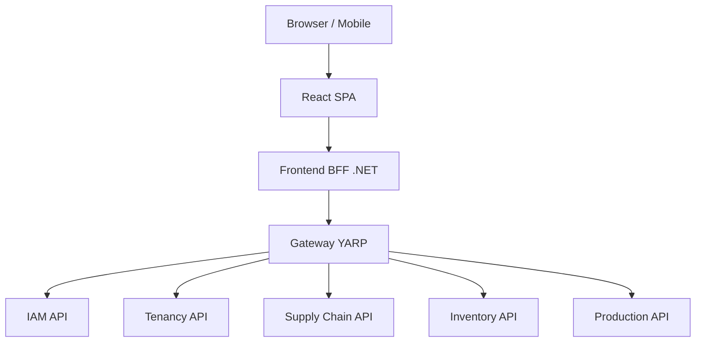
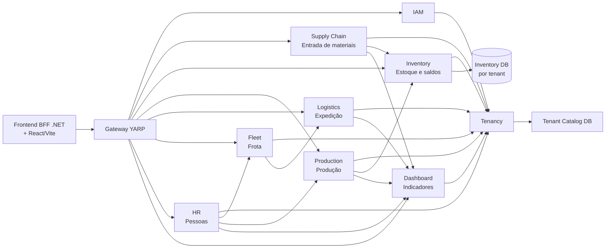
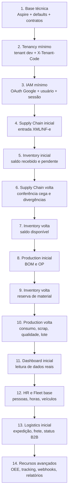
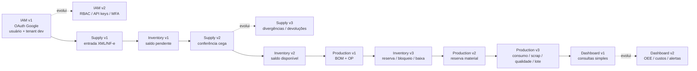
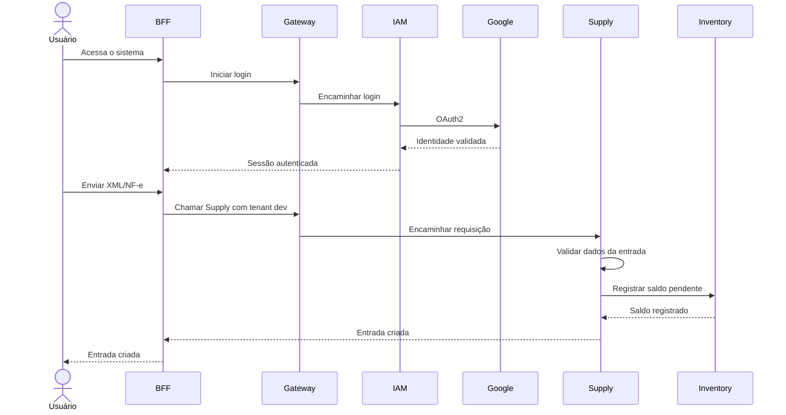
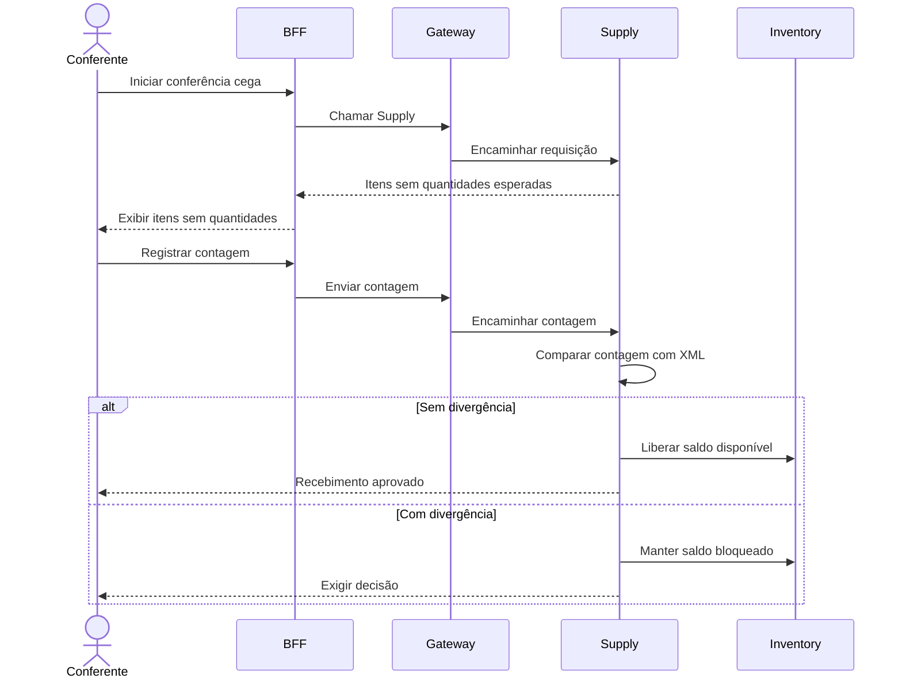
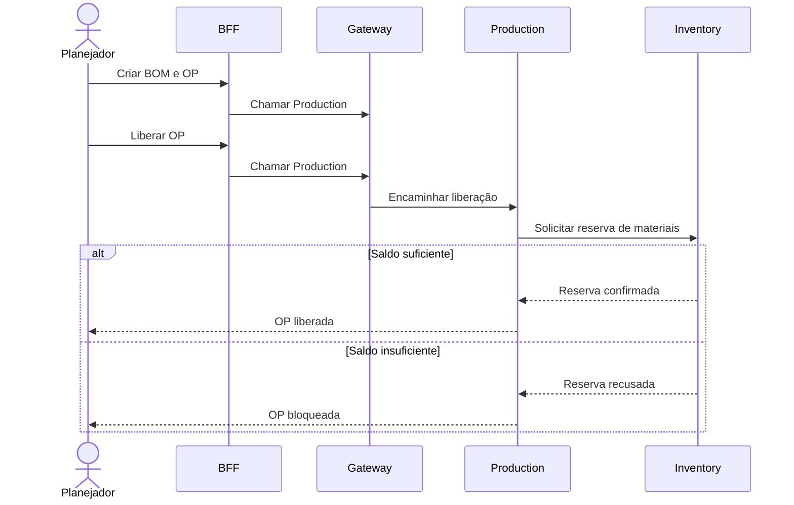

# Arquitetura Geral: Rail-Factory Fork

Este documento define a arquitetura alvo, padrões de engenharia, diagramas de dependência e contratos cross-domain do Rail-Factory Fork.

---

## 1. Visão Arquitetural

O sistema é um ERP industrial **multitenant** construído sobre uma **Arquitetura Hexagonal (Ports & Adapters)**.

### Objetivos Principais
- **Isolamento Total**: Dados de diferentes tenants nunca se misturam (DB por Tenant).
- **Integridade Hexagonal**: A regra de negócio (Domain) é protegida de tecnologias externas (DB, HTTP, Frameworks).
- **Consistência por Eventos**: Mudanças de estado que cruzam fronteiras de domínio usam o padrão **Outbox** para entrega atômica.

---

## 2. Componentes do Sistema (C4 — Containers)



### Papéis e Responsabilidades

| Componente | Responsabilidade | Segurança / Auth |
|---|---|---|
| **BFF** | Sessão Browser, CSRF, Orquestração de UI. | Emite **Internal JWT** (curto). |
| **Gateway** | Roteamento, Rate Limit, Normalização de Headers. | Valida Internal JWT / API Key. |
| **IAM** | Login (Google SSO), Usuários, Permissões. | Dono da Autenticação Primária. |
| **Tenancy** | Resolução e isolamento de tenant (connection strings). | Interna — sem exposição direta ao browser. |
| **Inventory** | **Único dono de saldo**, ledger e catálogo de materiais. | Proteção por Internal JWT + Tenant. |
| **Supply Chain** | Recebimento, XML/NF-e, Associação, Conferência e Devolução. | Proteção por Internal JWT + Tenant. |
| **Production** | Work Centers, BOM, Ordens de Produção, Execução. | Proteção por Internal JWT + Tenant. |

---

## 3. Visão Geral dos Domínios



**Leitura simples:**
- `IAM` e `Tenancy` sustentam o acesso ao sistema.
- `Supply Chain` alimenta o estoque.
- `Inventory` é uma fronteira própria e guarda saldos que outras áreas usam.
- `Production` depende de estoque para reservar e consumir material.
- `Dashboard` depende dos eventos/dados gerados pelas operações.
- `HR` e `Fleet` entram antes da expedição completa porque Logistics precisa de pessoas e veículos.

---

## 4. Ordem de Construção (Passadas)



*Cada domínio recebe uma primeira versão pequena; o projeto volta nele quando o fluxo exigir.*

---

## 5. Evolução por Domínio (Versões)



---

## 6. Protocolos de Prevenção Elite

### 6.1 Identidade Propagada (Audit Chain)
- O BFF gera um **Internal Bearer JWT** após validar a sessão do cookie.
- Este JWT contém o e-mail do usuário e o `tenantCode`.
- Serviços internos validam que o `tenant` do token coincide com o `X-Tenant-Code` da requisição (Prevenção de Replay Cross-Tenant).

### 6.2 Backend-Driven UI (BFF for Statuses)
- APIs retornam um objeto `DisplayStatus`: `{ "key": "pending", "label": "Pendente", "color": "warning" }`.
- O Frontend usa o componente `StatusChip.tsx` para renderizar o que o backend enviou.
- Hardcoding de cores/labels em componentes de feature é **proibido**.

### 6.3 Value Objects (Identidade de Negócio)
Identificadores críticos são **Value Objects** em `BuildingBlocks`:
- `MaterialCode`: Uppercase + Trim.
- `FiscalId`: Somente dígitos (CNPJ/CPF).
- `EmailAddress`: Lowercase + Trim.

### 6.4 State Machine Hardening (Status Guards)
Toda alteração de `Status` no domínio deve ser protegida por uma guarda explícita:
```csharp
if (Status != MaterialReceiptStatus.Registered)
    throw new InvalidOperationException("Conferência só pode iniciar em recibos Registrados.");
```

---

## 7. Fluxo de Requisição Protegido

1. **Browser** envia request com **Cookie de Sessão** + **Header CSRF** para o **BFF**.
2. **BFF** valida o cookie, valida o CSRF e resolve o usuário.
3. **BFF** gera um **Internal JWT** assinado (expira em 5 min) e repassa ao **Gateway**.
4. **Gateway** roteia para o microserviço.
5. **Microserviço** valida o **Internal JWT**, verifica tenant e executa a lógica.

---

## 8. Estratégia de Dados e Persistência

- **Isolamento**: Cada serviço tem seu próprio banco de dados (ex: `supplydb`, `inventorydb`).
- **Connection Strings**: O serviço de **Tenancy** é o único que sabe onde o banco de cada tenant está.
- **Migrations**: Versionamento de schema via Entity Framework Migrations é obrigatório.

---

## 9. Comunicação Cross-Domain (Event-Driven)

1. **Outbox Pattern**: O evento é salvo na mesma transação do banco de dados do serviço de origem.
2. **Event Dispatcher**: Processo de background lê o outbox e **publica para RabbitMQ** (exchange direto, durable). O Inventory consome via `InventoryIntegrationConsumer`. Endpoints HTTP `/api/inventory/internal/*` continuam ativos como fallback mas não são utilizados.
3. **Idempotência**: O serviço de destino valida o `eventId` para evitar duplicidade.

### Contratos Entre Domínios

| Origem | Destino | Contrato | Observação |
|---|---|---|---|
| Supply Chain | Inventory | Criar saldo pendente | A entrada NÃO gera saldo disponível antes da conferência. |
| Supply Chain | Inventory | Liberar ou bloquear saldo | Resultado da conferência cega. |
| Supply Chain | Inventory | Registrar devolução | Usado quando há divergência/defeito. |
| Production | Inventory | Reservar material | Obrigatório antes de liberar OP. |
| Production | Inventory | Consumir reserva | Baixa acontece contra reserva, não contra saldo livre. |
| Production | Inventory | Registrar scrap | Deve afetar ledger e rastreabilidade. |
| Logistics | Inventory | Separar/baixar produto acabado | Entra na expedição base. |
| Dashboard | Inventory/Production/Supply | Ler read models ou consultas consolidadas | NÃO deve duplicar regra de saldo. |

---

## 10. Sistema de Medidas (UoM)

**Comportamento atual:**
- A BOM define a UoM.
- A reserva usa a UoM da BOM.
- Consumo e scrap usam a UoM da reserva.
- Conversão automática de UoM **não entra no primeiro ciclo** de Production.

**Evolução planejada:**
1. Permitir UoM de entrada no consumo/scrap.
2. Resolver regra de conversão ativa.
3. Calcular quantidade canônica.
4. Registrar regra aplicada e auditar conversão.

---

## 11. Fluxos de Sequência Principais

### 11.1 IAM + Entrada de Materiais



### 11.2 Conferência Cega



### 11.3 Ciclo de Produção



---

## 12. Critério para Implementar Agora vs. Depois

**Implementar agora quando:**
- Desbloqueia o próximo fluxo.
- Reduz retrabalho.
- Respeita tenant.
- Usa dados reais ou prepara dado que será usado logo.
- Pode ser entregue sem criar complexidade artificial.

**Adiar quando:**
- Depende de dados que ainda não existem.
- Exige integração externa ainda não validada.
- Só faz sentido com alto volume de uso.
- Seria apenas demonstrativo neste momento.

**Evitar na primeira passada:**
- Dashboard em tempo real / OEE completo.
- Webhooks externos / roteirização.
- RBAC extremamente granular.
- Outbox em todos os serviços antes de haver eventos reais suficientes.
- Separar serviços em excesso se o fluxo ainda não exigir.

---

*Este documento é evolutivo e deve ser atualizado a cada mudança na direção arquitetural.*
