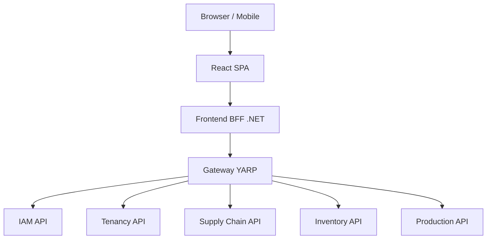

# Arquitetura Geral: Rail-Factory Fork

Este documento define a arquitetura alvo e os padrões de engenharia do Rail-Factory Fork. Ele serve como a diretriz técnica para garantir que o sistema seja robusto, escalável e fácil de manter, evitando o retrabalho através de "Qualidade de Primeira Vez" (FTQ).

## 1. Visão Arquitetural

O sistema é um ERP industrial **multitenant** construído sobre uma **Arquitetura Hexagonal (Ports & Adapters)**. 

### Objetivos Principais:
- **Isolamento Total**: Dados de diferentes tenants nunca se misturam (DB por Tenant).
- **Integridade Hexagonal**: A regra de negócio (Domain) é protegida de tecnologias externas (DB, HTTP, Frameworks).
- **Consistência por Eventos**: Mudanças de estado que cruzam fronteiras de domínio usam o padrão **Outbox** para garantir entrega atômica.

## 2. Componentes do Sistema (C4 Containers)



### Papéis e Responsabilidades:
| Componente | Responsabilidade | Segurança / Auth |
|---|---|---|
| **BFF** | Sessão Browser, CSRF, Orquestração de UI. | Emite **Internal JWT** (Curto). |
| **Gateway** | Roteamento, Rate Limit, Normalização de Headers. | Valida Internal JWT / API Key. |
| **IAM** | Login (Google SSO), Usuários, Permissões. | Dono da Autenticação Primária. |
| **Inventory** | **Único dono de saldo**, ledger e catálogo de materiais. | Proteção por Internal JWT + Tenant. |
| **Supply Chain** | Recebimento, XML/NF-e, Conferência e Devolução. | Proteção por Internal JWT + Tenant. |

## 3. Protocolos de Prevenção Elite

Para manter a integridade técnica, todos os serviços devem aderir a estes protocolos:

### 3.1 Identidade Propagada (Audit Chain)
A comunicação entre o BFF e os serviços internos não usa "confiança cega". 
- O BFF gera um **Internal Bearer JWT** após validar a sessão do cookie.
- Este JWT contém o e-mail do usuário e o `tenantCode`.
- Serviços internos validam que o `tenant` do token coincide com o `X-Tenant-Code` da requisição (Prevenção de Replay Cross-Tenant).

### 3.2 Backend-Driven UI (BFF for Statuses)
Nenhum componente de UI deve decidir a cor ou o texto de um status (ex: "Pendente", "Aprovado").
- APIs retornam um objeto `DisplayStatus`: `{ "key": "pending", "label": "Pendente", "color": "warning" }`.
- O Frontend usa o componente `StatusChip.tsx` para renderizar o que o backend enviou.

### 3.3 Value Objects (Identidade de Negócio)
Identificadores críticos não são `string` simples no domínio. Eles são **Value Objects** em `BuildingBlocks`:
- `MaterialCode`: Uppercase + Trim.
- `FiscalId`: Somente dígitos (CNPJ/CPF).
- `EmailAddress`: Lowercase + Trim.

### 3.4 State Machine Hardening (Status Guards)
Toda alteração de `Status` no domínio deve ser protegida por uma guarda explícita:
```csharp
if (Status != MaterialReceiptStatus.Registered) 
    throw new InvalidOperationException("Conferência só pode iniciar em recibos Registrados.");
```

## 4. Fluxo de Requisição Protegido

1. **Browser** envia request com **Cookie de Sessão** + **Header CSRF** para o **BFF**.
2. **BFF** valida o cookie, valida o CSRF e resolve o usuário.
3. **BFF** gera um **Internal JWT** assinado (expira em 5 min) e repassa ao **Gateway**.
4. **Gateway** roteia para o microserviço.
5. **Microserviço** valida o **Internal JWT**, verifica se o tenant do token é o mesmo da URL/Header e executa a lógica.

## 5. Estratégia de Dados e Persistência

- **Isolamento**: Cada serviço tem seu próprio banco de dados (ex: `supplydb`, `inventorydb`).
- **Connection Strings**: O serviço de **Tenancy** é o único que sabe onde o banco de cada tenant está localizado.
- **Migrations**: O versionamento de schema é obrigatório via Entity Framework Migrations.

## 6. Comunicação Cross-Domain (Event-Driven)

Sempre que uma ação em um domínio afeta outro (ex: "Conferência Aprovada" -> "Liberar Saldo"), usamos:
1. **Outbox Pattern**: O evento é salvo na mesma transação do banco de dados do serviço de origem.
2. **Event Dispatcher**: Um processo de background lê o outbox e publica no **RabbitMQ** ou faz uma chamada HTTP idempotente ao destino.
3. **Idempotência**: O serviço de destino deve validar o `eventId` para evitar duplicidade.

---
*Este documento é evolutivo e deve ser atualizado a cada mudança na direção arquitetural do projeto.*
