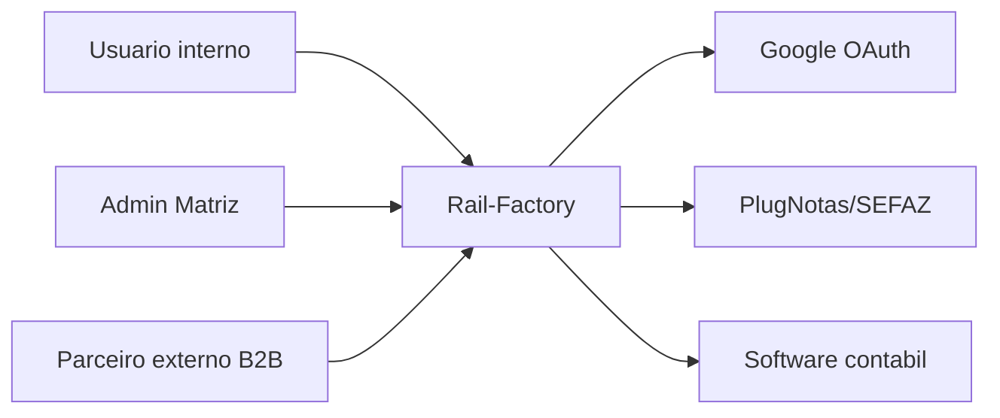
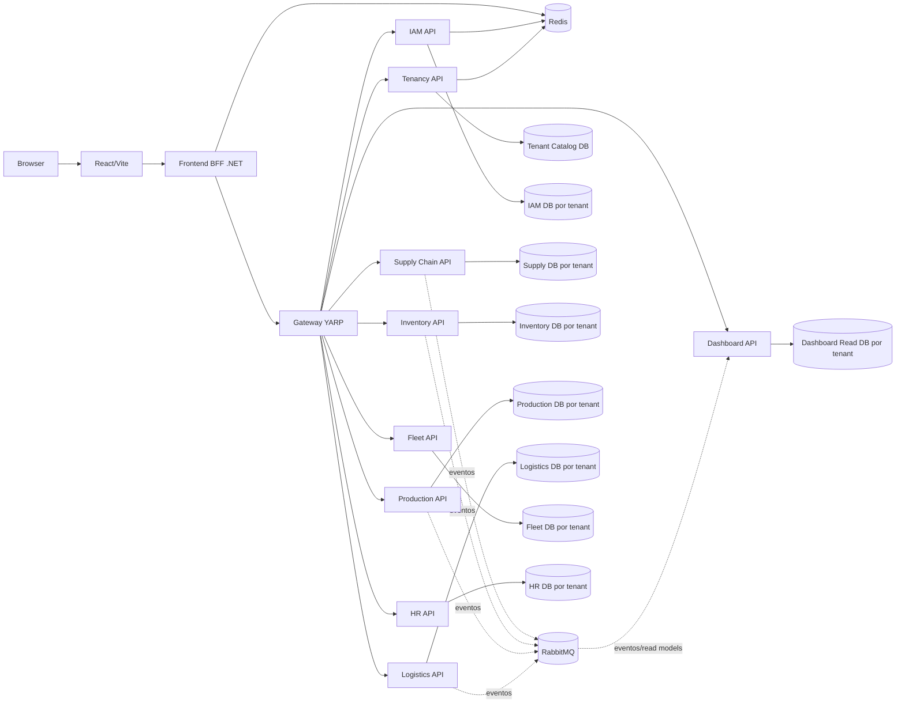
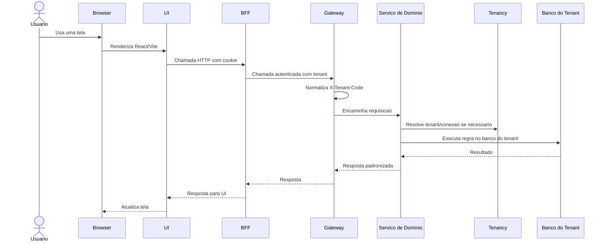

# Arquitetura Geral

Este documento define a arquitetura alvo do Rail-Factory Fork.

Ele nao substitui os requisitos. Ele explica como o sistema deve ser organizado para implementar os requisitos sem duplicar regra, sem esconder tenant e sem criar complexidade antes da hora.

## 1. Objetivo Arquitetural

O Rail-Factory Fork deve ser um ERP industrial multitenant, construido por fluxos incrementais.

A arquitetura precisa cumprir quatro objetivos:

- manter isolamento por tenant desde o primeiro fluxo;
- separar regra de negocio por dominio;
- evitar duplicacao de saldo, permissao, auditoria e roteamento;
- permitir evoluir de chamadas diretas para eventos/Outbox sem reescrever o dominio.

## 2. Principios

| Principio | Regra pratica |
|---|---|
| Tenant explicito | Toda operacao tenant-aware recebe, resolve ou persiste tenant de forma clara |
| Dominios com fronteira | Cada dominio possui responsabilidades proprias e contratos claros |
| Simples primeiro | A primeira versao entrega o menor fluxo real que desbloqueia o proximo |
| Evolucao por passadas | O sistema volta aos dominios quando o fluxo seguinte exigir |
| Sem saldo duplicado | Inventory e o unico dono de saldo, reserva, bloqueio e ledger |
| Sem contexto magico | Eventos, Outbox e jobs carregam `tenantCode` explicitamente |
| Borda clara | UI no browser chama BFF; BFF chama Gateway; Gateway chama servicos |

## 3. Visao C4 - Contexto

Leitura:

- Usuarios internos operam IAM, entrada, estoque, producao, expedicao, frota, pessoas e dashboards.
- Admin Matriz consulta dados consolidados quando houver mais de uma filial.
- Parceiros externos usam API B2B somente quando Logistics existir.
- Google autentica usuarios.
- PlugNotas/SEFAZ entram como provedores substituiveis de NF-e.
- Integracao contabil entra depois de HR/horas estarem estaveis.

## 4. Visao C4 - Containers

Observacoes:

- O fork comeca com tenant `dev`.
- O projeto deve nascer preparado para adicionar `qa` e outras filiais depois.
- Logistics, Fleet, HR e Dashboard podem nascer depois, mas suas fronteiras ja ficam documentadas.
- RabbitMQ pode existir no AppHost desde cedo, mas seu uso operacional entra por necessidade de fluxo.

## 5. Responsabilidades Dos Containers

| Container | Responsabilidade | Nao deve fazer |
|---|---|---|
| React/Vite | Interface do usuario rodando no browser | Chamar servicos internos diretamente |
| BFF .NET | Sessao, cookie, CSRF, usuario atual, fachada para o frontend | Implementar regra de dominio |
| Gateway YARP | Roteamento, normalizacao de tenant, rate limit, entrada unica das APIs | Guardar sessao de usuario |
| IAM | Login, usuario, permissao, sessao, API key, MFA, auditoria de seguranca | Controlar saldo ou regra operacional |
| Tenancy | Catalogo de tenants, status, connection strings e resolucao | Ser banco operacional dos dominios |
| Supply Chain | NF-e/XML, recebimento, conferencia cega, divergencia e devolucao | Controlar saldo disponivel final |
| Inventory | Saldo, bloqueio, reserva, consumo, ledger e inventario global | Conhecer detalhes de NF-e ou BOM |
| Production | BOM, Work Center, OP, consumo planejado, scrap, qualidade e lote | Recalcular saldo fora do Inventory |
| Logistics | Picking, packing, embarque, transportadora, frete e tracking | Criar produto acabado |
| Fleet | Veiculos, capacidade, manutencao, abastecimento, motorista/veiculo | Controlar pessoas como RH |
| HR | Pessoas, horas, competencias, turnos e integracao contabil | Controlar acesso ao sistema |
| Dashboard | Consultas, indicadores, alertas e relatorios | Duplicar regras de saldo/producao |

## 6. Fluxo De Requisicao

Regras:

- `X-Tenant-Code` e obrigatorio em APIs tenant-aware.
- Na primeira versao, o valor esperado e `dev`.
- Servicos nao devem assumir tenant fixo no codigo.
- Erros devem seguir contrato padronizado.

## 7. Multitenancy

Modelo alvo:

- Tenant Catalog separado.
- Banco por tenant e por servico operacional.
- Tenant inicial: `dev`.
- Header inicial: `X-Tenant-Code: dev`.

Regra de implementacao:

- request HTTP usa tenant resolvido pelo Gateway/servico;
- evento usa `tenantCode` no envelope;
- Outbox guarda `tenantCode`;
- job/background task recebe `tenantCode` explicitamente;
- logs e traces carregam `tenantCode` quando disponivel.

O tenant `qa` do projeto original nao entra na primeira reconstrucao, mas o desenho deve permitir adiciona-lo sem alterar contratos.

## 8. Inventory Como Fronteira Central

Inventory deve nascer em P2 porque entrada de materiais cria saldo.

Responsabilidades iniciais:

- criar saldo pendente a partir de recebimento;
- liberar saldo apos conferencia aprovada;
- bloquear saldo divergente;
- registrar devolucao;
- controlar local de estoque quando houver mais de um local fisico;
- manter ledger minimo.

Responsabilidades quando Production entrar:

- reservar material ao liberar OP;
- recusar reserva por saldo insuficiente;
- consumir reserva;
- registrar scrap;
- criar saldo de produto acabado ao finalizar OP;
- manter rastreabilidade minima entre consumo e lote.

Estados iniciais de saldo:

| Estado | Significado |
|---|---|
| `Pending` | Material recebido, ainda nao conferido |
| `Available` | Material liberado para uso |
| `Blocked` | Material com divergencia, defeito ou restricao |
| `Reserved` | Material reservado para OP ou expedicao |
| `Consumed` | Material consumido/baixado |

Supply Chain e Production nao podem manter uma segunda verdade de saldo.

## 9. Dados

Padrao inicial de bancos:

| Banco | Dono | Observacao |
|---|---|---|
| Tenant Catalog | Tenancy | Global, fora dos tenants |
| IAM DB `dev` | IAM | Usuarios, sessoes, permissoes, auditoria de seguranca |
| Supply DB `dev` | Supply Chain | Recebimentos, XML/NF-e, conferencias, divergencias |
| Inventory DB `dev` | Inventory | Saldos, reservas, bloqueios, ledger |
| Production DB `dev` | Production | BOM, Work Centers, OP, scrap, qualidade, lotes |
| Logistics DB `dev` | Logistics | Expedicoes, volumes, transportadoras, frete e status |
| Fleet DB `dev` | Fleet | Veiculos, capacidade, manutencao, abastecimento e alocacao |
| HR DB `dev` | HR | Pessoas, horas, competencias e turnos |
| Dashboard Read DB `dev` | Dashboard | Read models e indicadores derivados |

Regra:

- cada dominio persiste seus dados;
- consultas entre dominios usam API, read model ou evento;
- Dashboard nao deve consultar varios bancos para recriar regra de dominio.

## 10. Eventos E Outbox

Eventos devem ser modelados cedo, mas nem todo evento precisa ser publicado por RabbitMQ na primeira versao.

Envelope minimo:

| Campo | Obrigatorio | Motivo |
|---|---|---|
| `eventId` | Sim | Idempotencia e rastreabilidade |
| `eventType` | Sim | Roteamento e contrato |
| `eventVersion` | Sim | Evolucao do payload |
| `occurredAt` | Sim | Linha do tempo |
| `tenantCode` | Sim | Isolamento multitenant |
| `correlationId` | Sim | Observabilidade |
| `producer` | Sim | Origem |
| `payload` | Sim | Dados do acontecimento |

Primeiros eventos candidatos:

| Evento | Origem | Consumidores provaveis | Quando publicar de verdade |
|---|---|---|---|
| `MaterialReceiptCreated` | Supply Chain | Inventory, Dashboard | P2 se chamada direta nao bastar |
| `MaterialReceiptApproved` | Supply Chain | Inventory, Dashboard | P3 |
| `InventoryBalanceReleased` | Inventory | Dashboard | P3/P6 |
| `ProductionOrderReleased` | Production | Inventory, Dashboard | P5 |
| `MaterialReserved` | Inventory | Production, Dashboard | P5 |
| `MaterialConsumed` | Inventory | Production, Dashboard | P5 |
| `ShipmentDispatched` | Logistics | Dashboard, Webhook | P8/P9 |

Outbox entra primeiro onde perder evento causaria erro operacional:

- recebimento aprovado;
- reserva de material;
- consumo de material;
- finalizacao de OP;
- despacho.

## 11. Seguranca

Primeira versao:

- OAuth Google;
- sessao via BFF;
- tenant `dev`;
- autorizacao minima;
- deny by default em operacoes sensiveis;
- auditoria basica em login e operacoes de entrada de material.

Evolucao:

- RBAC granular;
- API keys;
- MFA;
- revogacao de sessoes;
- auditoria imutavel completa;
- politicas por recurso.

Politica de auditoria:

| Acao | Politica |
|---|---|
| Login, MFA, permissao, API key, mudanca de tenant | Fail-closed |
| Entrada, divergencia, reserva, consumo, despacho | Registrar no dominio e reconciliar auditoria se necessario |
| Consulta simples | Fail-open com log tecnico |

## 12. Observabilidade

Desde P0/P1:

- health checks por servico;
- logs estruturados;
- `correlationId`;
- `tenantCode` nos logs quando houver tenant;
- erros padronizados;
- traces basicos via ServiceDefaults/OpenTelemetry.

Depois:

- metricas de negocio;
- dashboards tecnicos;
- alertas operacionais;
- rastreio completo de eventos.

## 13. Ordem Arquitetural De Implementacao

| Passada | Arquitetura minima |
|---|---|
| P0 | AppHost, ServiceDefaults, Gateway, BFF, Postgres, Redis, RabbitMQ, Tenant Catalog |
| P1 | IAM, OAuth Google, tenant `dev`, sessao BFF, tenant header |
| P2 | Supply Chain inicial, Inventory API/DB, saldo pendente |
| P3 | Conferencia cega, saldo bloqueado/disponivel, ledger minimo |
| P4 | Production inicial, BOM, Work Centers, OP |
| P5 | Reserva/consumo via Inventory, scrap, qualidade, lote |
| P6 | Dashboard inicial lendo dados reais |
| P7 | HR e Fleet base |
| P8 | Logistics base |
| P9 | Integracoes externas e recursos avancados |
| P10 | Hardening, Outbox amplo, seguranca formal, performance, docs e deploy |

Status atual da implementacao:

O estado real deve ser consultado em `CONTEXTO_ATUAL.md`.

Resumo em 2026-05-01: P0 foi concluido como base inicial. Existem AppHost, ServiceDefaults, Gateway, BFF, UI, BuildingBlocks, PostgreSQL, Redis, RabbitMQ, Tenant Catalog, `ProblemDetails`, `X-Correlation-Id`, logs estruturados iniciais, contratos HTTP e convencoes event-driven. P1 foi iniciado pelo Tenancy com tenant `dev` persistido; a proxima etapa e resolver `X-Tenant-Code`.

## 14. Decisoes Em Aberto

Estas decisoes ainda precisam ser detalhadas em documentos proprios:

| Tema | Decisao pendente |
|---|---|
| APIs | Contratos completos dos proximos endpoints de dominio |
| Dados | Migrations formais por servico; Tenancy possui initializer inicial para `tenants` |
| Eventos | Payloads dos eventos de negocio e regras de Outbox/idempotencia por fluxo |
| RBAC | Permissoes minimas por tela/acao |
| Auditoria | Formato final da trilha e retencao |
| Dashboard | Estrategia de read model |
| Deploy | Perfil local, dev, qa e producao |
