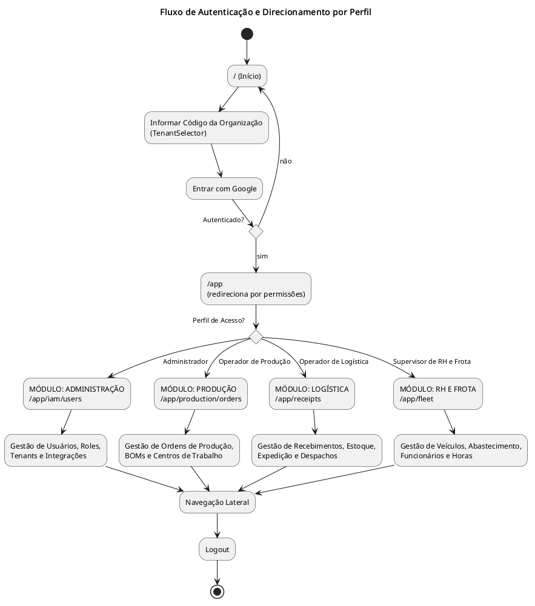
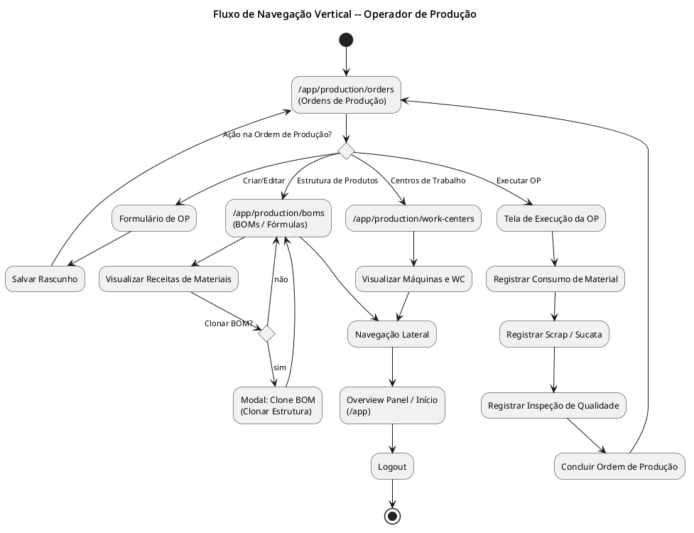
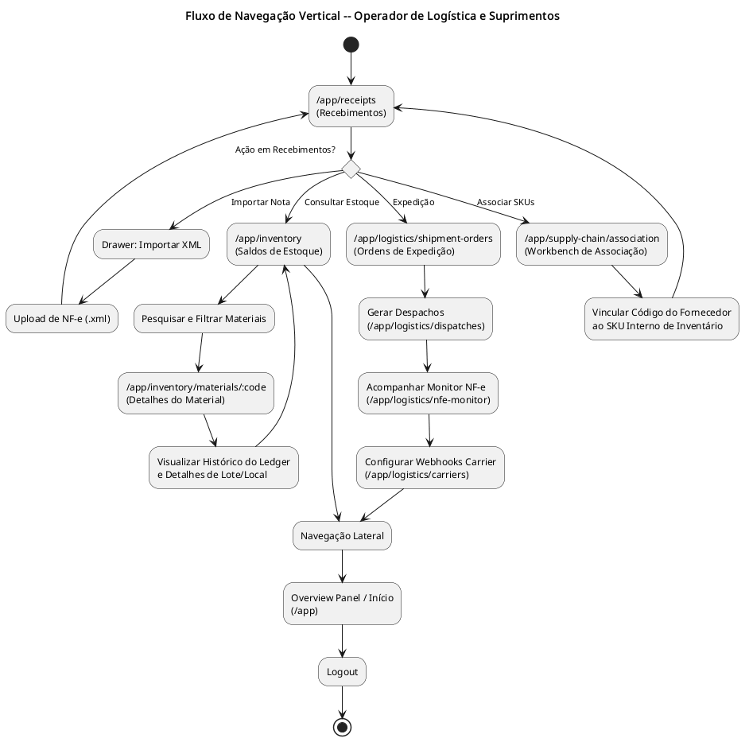
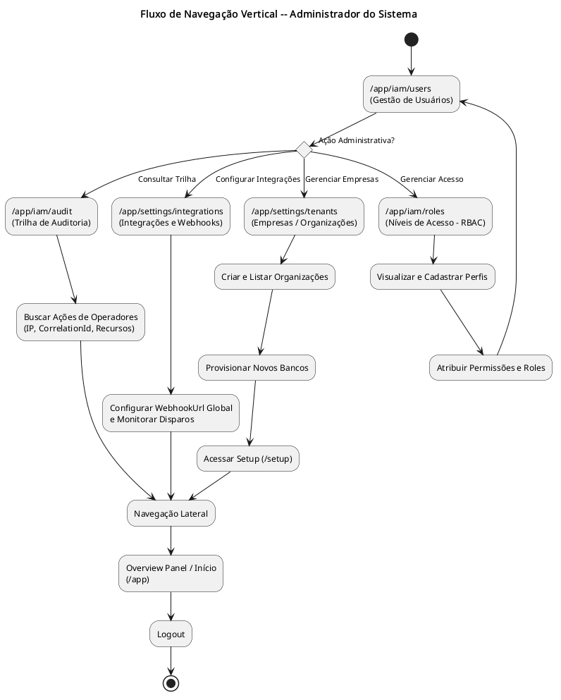
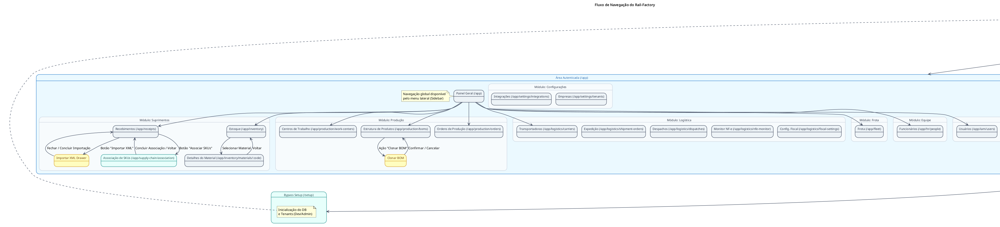
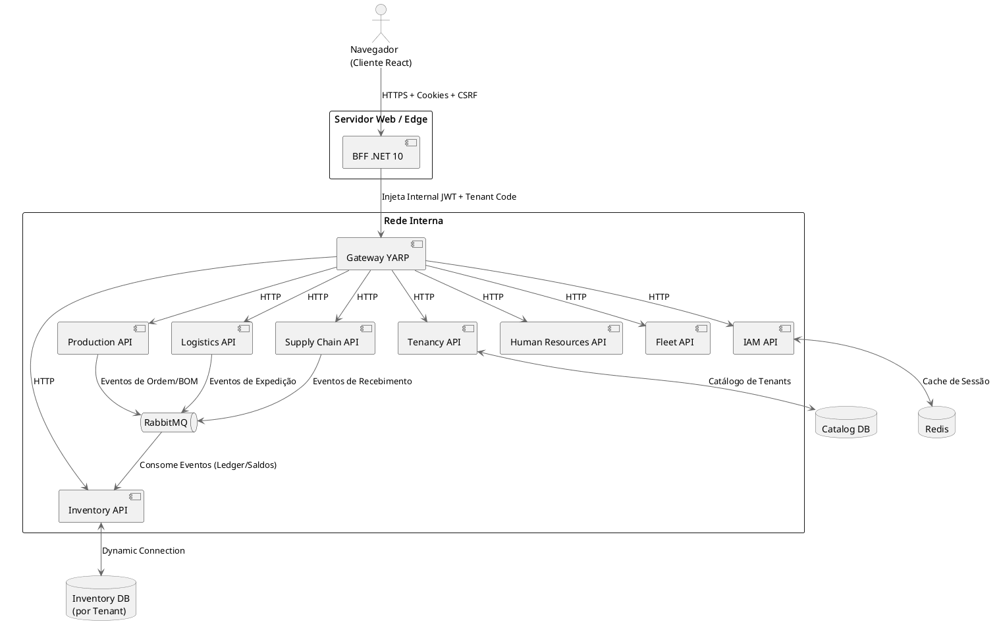
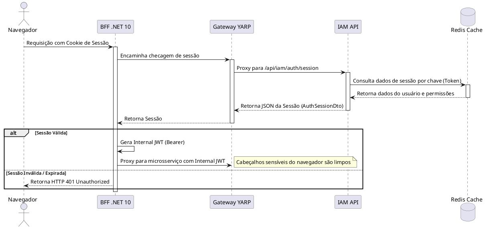
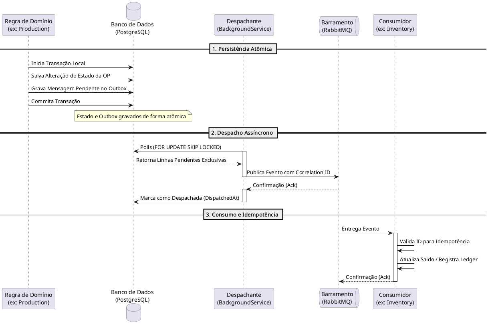

# Diagramas do Rail-Factory

Este documento compila todos os diagramas de arquitetura, fluxo e integração do projeto Rail-Factory Fork.

---

### Figura 01 - Fluxo de Autenticação e Redirecionamento por Perfil (Vertical)

*Fonte: Produzido pelo autor (2026).*

---

### Figura 02 - Fluxo de Navegação do Operador de Produção (Vertical)

*Fonte: Produzido pelo autor (2026).*

---

### Figura 03 - Fluxo de Navegação do Operador de Logística e Suprimentos (Vertical)

*Fonte: Produzido pelo autor (2026).*

---

### Figura 04 - Fluxo de Navegação do Administrador do Sistema (Vertical)

*Fonte: Produzido pelo autor (2026).*

---

### Figura 05 - Visão Geral do Fluxo de Navegação da Área Autenticada (Estados)

*Fonte: Produzido pelo autor (2026).*

---

### Figura 06 - Arquitetura Geral de Microsserviços e Dependências

*Fonte: Produzido pelo autor (2026).*

---

### Figura 07 - Mecanismo de Verificação e Propagação de Sessão (Sequence Diagram)

*Fonte: Produzido pelo autor (2026).*

---

### Figura 08 - Fluxo de Mensageria Assíncrona com Outbox Pattern

*Fonte: Produzido pelo autor (2026).*
