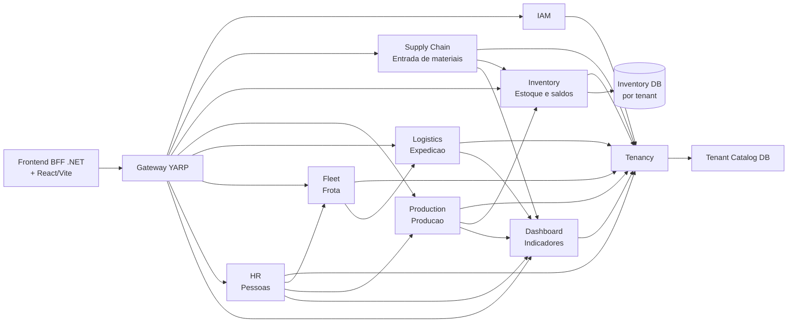
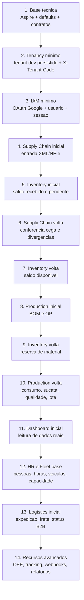
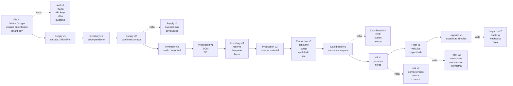
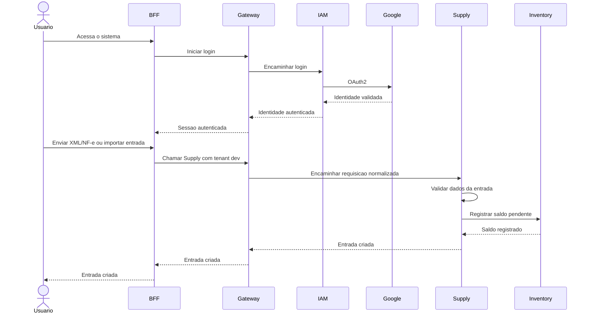
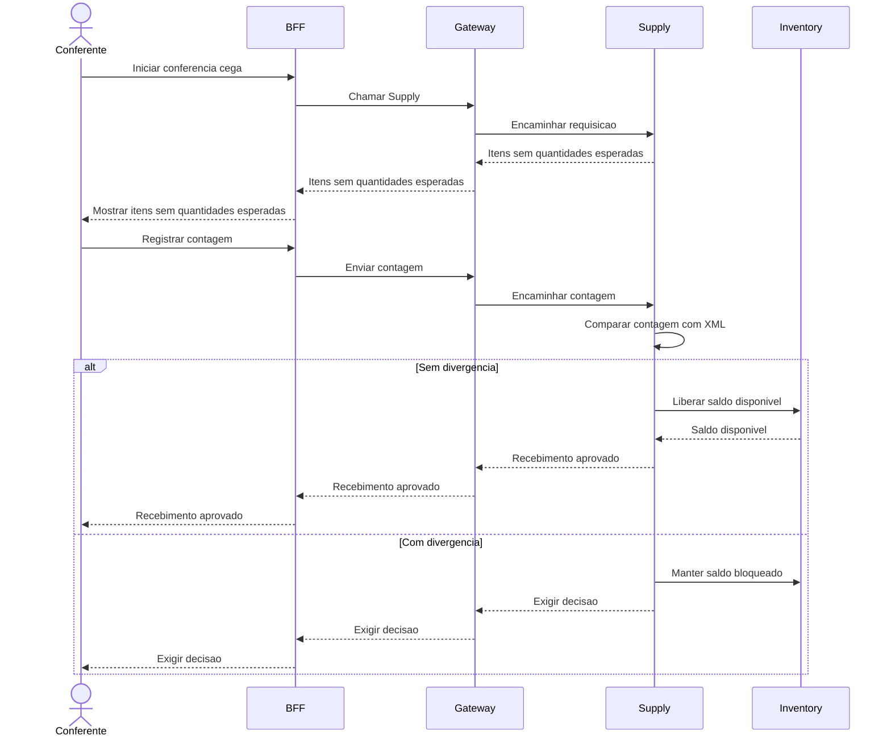
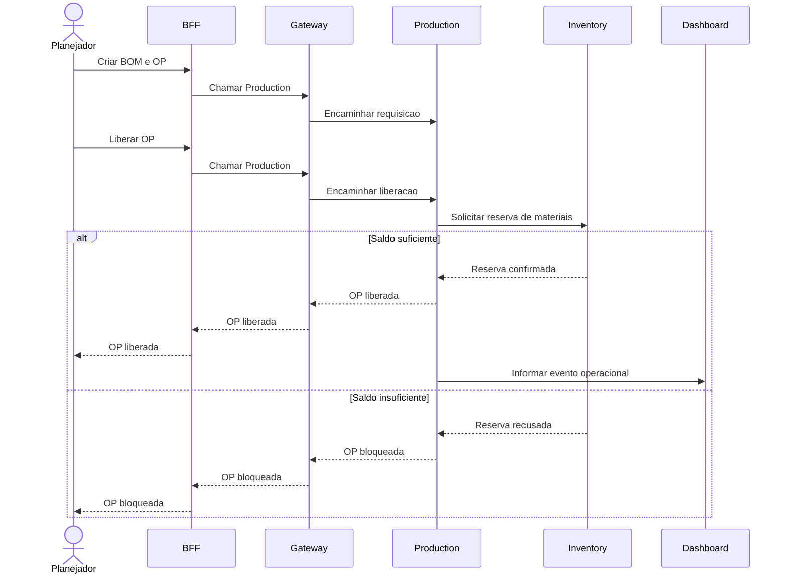

# Grafos do Projeto

Este documento mostra o Rail-Factory como um conjunto de partes conectadas.

O objetivo dos grafos e ajudar a decidir a ordem de construcao sem perder a visao do sistema completo.

## 1. Visao Geral dos Dominios

Leitura simples:

- `IAM` e `Tenancy` sustentam o acesso ao sistema.
- `Supply Chain` alimenta o estoque.
- `Inventory` e uma fronteira propria e guarda saldos que outras areas usam.
- `Production` depende de estoque para reservar e consumir material.
- `Dashboard` depende dos eventos/dados gerados pelas operacoes.
- `HR` e `Fleet` entram antes da expedicao completa porque Logistics precisa de pessoas, motoristas e veiculos.

## 2. Ordem de Construcao

Essa ordem nao significa que um dominio fica completo antes do proximo.

Ela significa que cada dominio recebe uma primeira versao pequena e depois o projeto volta nele quando o fluxo exigir.

Status atual:

Consultar `CONTEXTO_ATUAL.md` para o estado real. Em 2026-05-01, P0 foi concluido como base inicial e P1 foi iniciado pelo Tenancy: tenant `dev` persistido no Tenant Catalog. A proxima aresta do grafo e o resolver `X-Tenant-Code`.

## 3. Passadas Por Dominio

## 4. Fluxo Inicial: IAM + Entrada de Materiais

## 5. Fluxo Depois Da Conferencia Cega

## 6. Fluxo De Producao

## 7. O Que Evitar No Inicio

Evitar na primeira passada:

- dashboard em tempo real;
- OEE completo;
- webhooks externos;
- roteirizacao inteligente;
- telemetria;
- RBAC extremamente granular;
- Outbox em todos os servicos antes de haver eventos reais suficientes;
- separar servicos em excesso se o fluxo ainda nao exigir.

Nao significa que esses itens sairam do projeto. Significa apenas que eles entram quando houver base real para usa-los.
