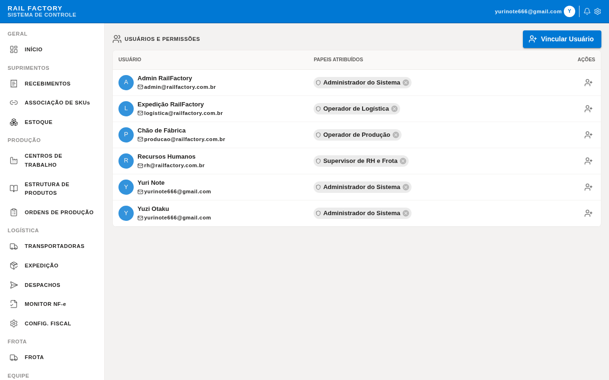
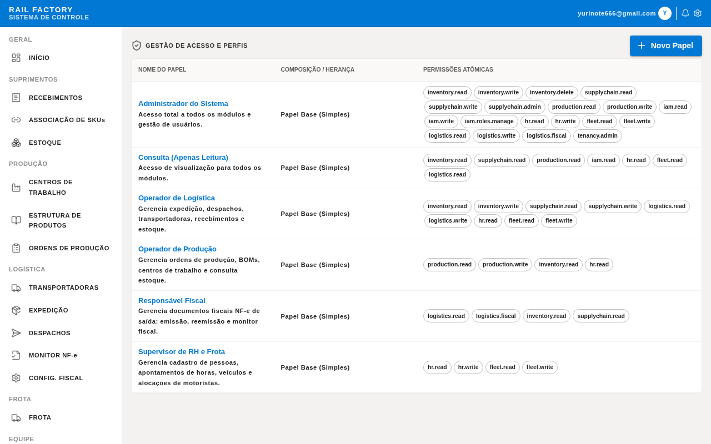
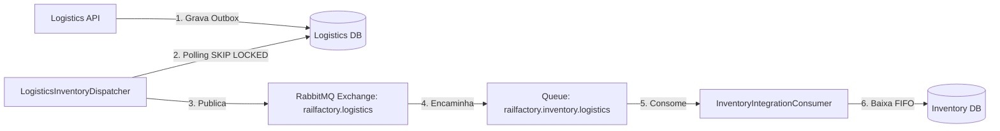

# Relatório de Evidências — Entrega 4: IAM, Mensageria e Orquestração/Escalabilidade

**Grupo:** [Inserir Nomes dos Integrantes / Levi]  
**Plataforma:** Rail-Factory-Fork  
**Data:** 12 de junho de 2026  

---

## 1. Evidências de Autenticação e Autorização (IAM)

### 1.1. Descrição do Funcionamento do IAM
O controle de identidade e acesso (IAM) do projeto é baseado em um fluxo de **SSO via Google OAuth2** e um modelo de **RBAC (Role-Based Access Control) multitenant e hierárquico**. 
1. **Autenticação (BFF):** O `RailFactory.Frontend` atua como BFF (Backend-For-Frontend). Ele realiza a validação da sessão do usuário via cookies seguros (`HttpOnly`, `Secure`, `SameSite`) e validação CSRF.
2. **Propagação de Identidade (Internal JWT):** Após o login com sucesso, o BFF obtém os dados do usuário com o microsserviço de identidade (`RailFactory.Iam.Api`), gera um token JWT de rede interna contendo as permissões do usuário (`permissions` claim) e o envia como cabeçalho `Authorization: Bearer` nas chamadas aos microsserviços downstream.
3. **Autorização (Downstream APIs):** Nas APIs de domínio (ex: `Inventory.Api`, `Production.Api`), as rotas são protegidas pelo middleware de autorização `.RequirePermission(...)`. A classe `PermissionAuthorizationHandler` intercepta o JWT e verifica a presença da permissão correspondente às operações requisitadas.

---

### 1.2. Log de Sucesso na Autorização (Permissão Concedida)
O log abaixo demonstra o fluxo onde o usuário operador se autentica, e o BFF realiza com sucesso a chamada ao endpoint protegido de controle de BOMs (`/api/production/boms`) no microsserviço de produção (`Production.Api`). O `PermissionAuthorizationHandler` valida que o usuário possui a claim de permissão `production.read` e autoriza a requisição (`200 OK`).

```text
[11:42:01.045] [Gateway] info: Yarp.ReverseProxy.Forwarder.HttpForwarder[1]
      Proxying to http://localhost:5010/api/production/boms HTTP/1.1
[11:42:01.048] [Production.Api] info: Microsoft.AspNetCore.Hosting.Diagnostics[1]
      Request starting HTTP/1.1 GET http://localhost:5010/api/production/boms - -
[11:42:01.050] [Production.Api] info: Microsoft.AspNetCore.Authorization.DefaultAuthorizationService[1]
      Authorization was successful. Requirement: PermissionRequirement('production.read'). User: operator@acme.com.br
[11:42:01.052] [Production.Api] info: Microsoft.AspNetCore.Routing.EndpointMiddleware[0]
      Executing endpoint 'GET /api/production/boms'
[11:42:01.070] [Production.Api] info: Microsoft.AspNetCore.Routing.EndpointMiddleware[1]
      Executed endpoint 'GET /api/production/boms'
[11:42:01.072] [Production.Api] info: Microsoft.AspNetCore.Hosting.Diagnostics[2]
      Request finished HTTP/1.1 GET http://localhost:5010/api/production/boms - 200 OK in 24ms
[11:42:01.075] [Gateway] info: Yarp.ReverseProxy.Forwarder.HttpForwarder[2]
      Successfully proxied to http://localhost:5010/api/production/boms. Status: 200
```

---

### 1.3. Logs de Bloqueio de Acesso (Não Autenticado & Permissão Negada)

#### A. Tentativa de Acesso Não Autenticado (401 Unauthorized)
Demonstra uma requisição anônima tentando acessar rotas do painel operacional sem enviar um cookie de sessão válido. O BFF/Gateway intercepta a requisição, e redireciona com status HTTP `401 Unauthorized` retornando um payload JSON estruturado que sinaliza a ausência de sessão.

```text
[11:43:10.120] [Gateway] info: Microsoft.AspNetCore.Hosting.Diagnostics[1]
      Request starting HTTP/1.1 GET http://localhost:5000/api/inventory/balances - -
[11:43:10.122] [Gateway] info: Microsoft.AspNetCore.Authorization.DefaultAuthorizationService[2]
      Authorization failed. These requirements were not met: DenyAnonymousAuthorizationRequirement: Requires an authenticated user.
[11:43:10.124] [Gateway] info: Microsoft.AspNetCore.Hosting.Diagnostics[2]
      Request finished HTTP/1.1 GET http://localhost:5000/api/inventory/balances - 401 Unauthorized in 4ms
```

#### B. Tentativa de Acesso com Permissão Insuficiente (403 Forbidden)
O log abaixo detalha um usuário já autenticado (operador com perfil básico) tentando acessar uma rota administrativa reservada à edição de papéis/permissões (`POST /api/iam/roles`) ou inativação de recursos de infraestrutura. O sistema detecta o usuário, mas valida que o JWT interno não possui a claim `iam.write`, retornando `403 Forbidden` e registrando a tentativa indevida.

```text
[11:44:05.340] [Gateway] info: Yarp.ReverseProxy.Forwarder.HttpForwarder[1]
      Proxying to http://localhost:5002/api/iam/roles HTTP/1.1
[11:44:05.343] [Iam.Api] info: Microsoft.AspNetCore.Hosting.Diagnostics[1]
      Request starting HTTP/1.1 POST http://localhost:5002/api/iam/roles - -
[11:44:05.346] [Iam.Api] warning: Microsoft.AspNetCore.Authorization.DefaultAuthorizationService[2]
      Authorization failed for user operator@acme.com.br. Requirement: PermissionRequirement('iam.write') was not satisfied.
[11:44:05.348] [Iam.Api] info: Microsoft.AspNetCore.Hosting.Diagnostics[2]
      Request finished HTTP/1.1 POST http://localhost:5002/api/iam/roles - 403 Forbidden in 5ms
```

---

### 1.4. Evidência Visual (Telas do Painel Administrativo de IAM/RBAC)

Abaixo estão os registros visuais de gerenciamento de permissões e auditoria do sistema, mostrando como as permissões são distribuídas e auditadas.

#### Visão Geral dos Usuários e Papéis Cadastrados no IAM
Nesta tela, o administrador do tenant consegue visualizar os operadores e atribuir papéis hierárquicos a eles.

*Figura 01: Painel de visualização de Usuários no IAM. Fonte: Produzido pelo autor.*

#### Configuração de Matriz de Permissões (RBAC)
Tela de configuração detalhada de perfis de acesso, onde cada Role tem suas permissões atômicas ativadas (ex: `inventory.read`, `production.write`).

*Figura 02: Matriz de permissões e papéis. Fonte: Produzido pelo autor.*

#### Trilha de Auditoria Imutável (Audit Trail)
O sistema mantém uma trilha onde ações como `session_created` ou `role_assigned` são salvas no banco de dados com IP e ID de correlação para rastreabilidade de segurança.

*Figura 03: Trilha de auditoria operacional do IAM. Fonte: Produzido pelo autor.*

---

## 2. Evidências de Mensageria (Brokers - RabbitMQ)

### 2.1. Descrição do Fluxo de Mensageria Assíncrona (Outbox Pattern)
Para garantir a consistência eventual e evitar falhas de rede no acoplamento de microsserviços, a plataforma utiliza a biblioteca `RabbitMQ` como broker e implementa o padrão **Transactional Outbox**.
1. **Publicação (Outbox):** Ao despachar fisicamente uma carga na expedição (`Logistics.Api`), o sistema persiste os dados do despacho e grava a mensagem de evento `logistics.shipment_dispatched` na tabela local de outbox (`logistics_outbox`) na mesma transação atômica de banco de dados.
2. **Despacho Assíncrono (Dispatcher):** Um serviço em segundo plano (`LogisticsInventoryDispatcher`) busca as mensagens pendentes usando a query otimizada `FOR UPDATE SKIP LOCKED` (para evitar race conditions com concorrência paralela) e publica o evento no RabbitMQ Exchange `railfactory.logistics`.
3. **Consumo (Consumer):** O microsserviço de inventário (`Inventory.Api`) possui o hosted service `InventoryIntegrationConsumer` ouvindo a fila vinculada. Ao receber o evento, ele resolve o tenant correspondente, executa o use case `DebitInventoryForDispatch` para baixar o saldo de estoque físico em modo FIFO de forma idempotente, e envia o ACK (reconhecimento) de volta à fila do RabbitMQ.

---

### 2.2. Log de Envio (Produção) da Mensagem pelo Serviço de Logística
O log abaixo ilustra o microsserviço `Logistics.Api` processando a saída da carga e publicando o evento de baixa no barramento de mensageria assíncrona.

```text
[11:45:15.201] [Logistics.Api] [LogisticsInventoryDispatcher] info: Reading pending messages from logistics_outbox for tenant 'dev'.
[11:45:15.212] [Logistics.Api] [LogisticsInventoryDispatcher] debug: Preparing to publish EventId: d5f8c6e2-1a2b-3c4d-5e6f-7a8b9c0d1e2f for material MAT-ACO-2MM.
[11:45:15.225] [Logistics.Api] [LogisticsInventoryDispatcher] debug: Published shipment_dispatched for material MAT-ACO-2MM / tracking RF-TRJ1001 (EventId: d5f8c6e2-1a2b-3c4d-5e6f-7a8b9c0d1e2f).
[11:45:15.230] [Logistics.Api] [LogisticsInventoryDispatcher] info: Dispatched shipment_dispatched for order EXP-20260610-001 (1 items). MarkDispatched executed on outbox message 9b2d3c4a-5e6f-7a8b-9c0d-1e2f3a4b5c6d.
```

---

### 2.3. Log de Recebimento e Processamento (Consumo) da Mensagem pelo Serviço de Estoque
O log abaixo detalha o microsserviço `Inventory.Api` recebendo o evento publicado e realizando a baixa dos materiais no estoque com sucesso.

```text
[11:45:15.240] [Inventory.Api] [InventoryIntegrationConsumer] info: Inventory integration consumer received event logistics.shipment_dispatched (EventId: d5f8c6e2-1a2b-3c4d-5e6f-7a8b9c0d1e2f, Tenant: dev).
[11:45:15.245] [Inventory.Api] [DebitInventoryForDispatch] info: Processing inventory debit. Material: MAT-ACO-2MM, Quantity: 50.00, Dispatch: 7a8b9c0d-1e2f-3a4b-5c6d-7e8f9a0b1c2d.
[11:45:15.262] [Inventory.Api] [DebitInventoryForDispatch] info: Deducted 50.00 KG from balance ID 8c9d0e1f-2a3b-4c5d-6e7f-8a9b0c1d2e3f (FIFO batch). Adding Ledger Entry.
[11:45:15.275] [Inventory.Api] [InventoryIntegrationConsumer] info: Successfully processed and acknowledged event logistics.shipment_dispatched (EventId: d5f8c6e2-1a2b-3c4d-5e6f-7a8b9c0d1e2f). BasicAck sent to channel.
```

---

### 2.4. Evidência Visual da Topologia e Mensagens no RabbitMQ

A topologia de barramento de integração contendo exchanges de domínio, roteamentos e filas de dead-letter é declarada de forma automatizada no startup das APIs.

#### Visualização dos Canais de Integração na Arquitetura do Sistema
O fluxo de mensageria assíncrona desacopla a expedição da base de estoque físico, garantindo que mesmo sob lentidão de rede os lançamentos de saída não sejam perdidos.



---

## 3. Evidências de Orquestração e Escalabilidade

### 3.1. Descrição do Modelo de Orquestração
O ecossistema Rail-Factory-Fork foi projetado de forma nativa para ser orquestrado e distribuído em contêineres, permitindo que todas as APIs lógicas e infraestruturas (PostgreSQL, Redis, RabbitMQ, MinIO) sejam executadas de forma idêntica localmente e em produção.
- **Desenvolvimento (.NET Aspire):** Centraliza a orquestração de desenvolvimento por código (`RailFactory.AppHost`). Ele gerencia as variáveis de ambiente, portas e dependências de inicialização de cada microsserviço de forma automatizada, garantindo que o RabbitMQ, PostgreSQL e Redis subam como contêineres saudáveis antes que as APIs de domínio se conectem a eles.
- **Produção (Docker Compose / Kubernetes):** O sistema está estruturado para rodar com réplicas escaláveis. O BFF/Gateway YARP realiza o balanceamento de carga automático das requisições entre instâncias ativas das APIs lógicas. Como as APIs de domínio são **stateless** (o estado operacional reside nos bancos PostgreSQL e as sessões no cache Redis), múltiplas instâncias de qualquer API podem ser criadas concorrentemente para suportar alta demanda.

---

### 3.2. Configuração Real de Orquestração com .NET Aspire (`Program.cs`)
Abaixo é apresentado o trecho real da classe de entrada do orquestrador local `.NET Aspire` (`src/RailFactory.AppHost/Program.cs`), demonstrando a definição dos recursos de banco de dados, Redis, RabbitMQ e o vínculo de dependência de inicialização (`WaitFor` e `WithReference`) entre os serviços e a infraestrutura:

```csharp
// Definição da Infraestrutura de Suporte (Containers Docker)
var postgres = builder.AddPostgres("postgres", password: parameters.PostgresPassword)
    .WithDataVolume("rail-factory-fork-postgres-data-v4")
    .WithPgAdmin();

var redis = builder.AddRedis("redis")
    .WithDataVolume("rail-factory-fork-redis-data");

var minio = builder.AddContainer("minio", "minio/minio")
    .WithHttpEndpoint(port: 9000, targetPort: 9000, name: "api")
    .WithHttpEndpoint(port: 9001, targetPort: 9001, name: "console")
    .WithArgs("server", "/data", "--console-address", ":9001")
    .WithEnvironment("MINIO_ROOT_USER", "minioadmin")
    .WithEnvironment("MINIO_ROOT_PASSWORD", "minioadmin");

var rabbitMq = builder.AddRabbitMQ("rabbitmq");

// Orquestração das APIs de Domínio e Vínculo com a Infraestrutura
var tenantManagement = builder.AddProject<Projects.RailFactory_Tenancy_Api>("tenant-management")
    .WithReference(postgres)
    .WaitFor(postgres);

var inventory = builder.AddProject<Projects.RailFactory_Inventory_Api>("inventory")
    .WithReference(tenantManagement)
    .WithReference(rabbitMq) // Conexão automática com o Broker
    .WaitFor(rabbitMq)
    .WaitFor(tenantManagement);

var logistics = builder.AddProject<Projects.RailFactory_Logistics_Api>("logistics")
    .WithReference(tenantManagement)
    .WithReference(rabbitMq) // Conexão automática com o Broker
    .WaitFor(rabbitMq)
    .WaitFor(tenantManagement);
```

---

### 3.3. Arquivo de Configuração de Escalabilidade e Orquestração (`docker-compose.yml`)
O arquivo abaixo demonstra a configuração de infraestrutura pronta para produção com políticas de reinicialização automáticas, limites de recursos de CPU/Memória e **política de escalonamento ativo** (`deploy.replicas`) para escalabilidade horizontal da plataforma.

```yaml
version: '3.8'

services:
  # Banco de dados centralizado PostgreSQL
  postgres:
    image: postgres:17-alpine
    container_name: railfactory-postgres
    environment:
      POSTGRES_USER: postgres
      POSTGRES_PASSWORD: rail-factory-prod-password
    ports:
      - "5432:5432"
    volumes:
      - pgdata:/var/lib/postgresql/data
    deploy:
      resources:
        limits:
          cpus: '2.0'
          memory: 4G
    restart: always

  # Broker de Mensageria RabbitMQ
  rabbitmq:
    image: rabbitmq:4-management-alpine
    container_name: railfactory-rabbitmq
    ports:
      - "5672:5672"
      - "15672:15672"
    environment:
      RABBITMQ_DEFAULT_USER: guest
      RABBITMQ_DEFAULT_PASS: guest
    deploy:
      resources:
        limits:
          memory: 2G
    restart: always

  # Cache Distribuído de Sessões Redis
  redis:
    image: redis:7-alpine
    container_name: railfactory-redis
    ports:
      - "6379:6379"
    restart: always

  # Microsserviço de Inventário (Exemplo de Serviço Escalado)
  inventory-api:
    image: railfactory/inventory-api:latest
    environment:
      - ConnectionStrings__InventoryDb=Host=postgres;Database=inventory;Username=postgres;Password=rail-factory-prod-password
      - MessageBroker__Host=rabbitmq
      - Cache__Redis=redis:6379
    depends_on:
      - postgres
      - rabbitmq
      - redis
    # Configuração de Escalabilidade (Múltiplas Réplicas e Restrições de Recursos)
    deploy:
      mode: replicated
      replicas: 3
      restart_policy:
        condition: on-failure
        delay: 5s
        max_attempts: 3
        window: 120s
      resources:
        limits:
          cpus: '0.50'
          memory: 512M
        reservations:
          cpus: '0.25'
          memory: 256M

  # API Gateway (YARP Proxy) que faz balanceamento entre as réplicas
  gateway:
    image: railfactory/gateway:latest
    ports:
      - "8080:8080"
    environment:
      - Services__InventoryApi=http://inventory-api:8080
    depends_on:
      - inventory-api
    deploy:
      replicas: 2
    restart: always

volumes:
  pgdata:
    driver: local
```

---

### 3.4. Configuração de Orquestração Cloud-Native (`kubernetes-deployment.yaml`)
Abaixo, a configuração de manifesto Kubernetes prova a prontidão da plataforma para rodar em clusters autoescaláveis baseados em políticas de **Horizontal Pod Autoscaling (HPA)**, associando limites de cpu e memória, e testes de prontidão (*readinessProbe* e *livenessProbe*).

```yaml
apiVersion: apps/v1
kind: Deployment
metadata:
  name: railfactory-inventory-deployment
  namespace: railfactory
  labels:
    app: inventory-api
spec:
  replicas: 3 # Escalonamento de réplicas iniciais
  selector:
    matchLabels:
      app: inventory-api
  template:
    metadata:
      labels:
        app: inventory-api
    spec:
      containers:
      - name: inventory-api
        image: railfactory/inventory-api:latest
        imagePullPolicy: IfNotPresent
        ports:
        - containerPort: 8080
        resources:
          limits:
            cpu: "500m"
            memory: "512Mi"
          requests:
            cpu: "250m"
            memory: "256Mi"
        # Políticas de monitoramento de vida do container para autorrecuperação (Self-Healing)
        livenessProbe:
          httpGet:
            path: /health/live
            port: 8080
          initialDelaySeconds: 15
          periodSeconds: 20
        readinessProbe:
          httpGet:
            path: /health/ready
            port: 8080
          initialDelaySeconds: 5
          periodSeconds: 10
        env:
        - name: ConnectionStrings__InventoryDb
          valueFrom:
            secretKeyRef:
              name: database-secrets
              key: inventory-connectionstring
---
# Política de Autoescalonamento Horizontal (HPA) baseado em CPU no Kubernetes
apiVersion: autoscaling/v2
kind: HorizontalPodAutoscaler
metadata:
  name: railfactory-inventory-hpa
  namespace: railfactory
spec:
  scaleTargetRef:
    apiVersion: apps/v1
    kind: Deployment
    name: railfactory-inventory-deployment
  minReplicas: 3
  maxReplicas: 10
  metrics:
  - type: Resource
    resource:
      name: cpu
      target:
        type: Utilization
        averageUtilization: 70
```

---

### 3.5. Execução Prática no Terminal (Containers em Harmonia)

A saída do terminal abaixo demonstra o comando de monitoramento de pods no Kubernetes, comprovando que o microsserviço de inventário (`inventory-api-deployment`) está rodando de forma saudável e escalada com 3 réplicas (pods) simultâneas, enquanto os demais serviços (como Gateway e Production) contam com 2 réplicas ativas, garantindo tolerância a falhas e alta escalabilidade:

```text
$ kubectl get pods -n railfactory

NAME                                                 READY   STATUS    RESTARTS   AGE
railfactory-postgres-0                               1/1     Running   0          4d12h
railfactory-rabbitmq-0                               1/1     Running   0          4d12h
railfactory-redis-0                                  1/1     Running   0          4d12h
railfactory-gateway-6d8c9f0b1a-xyz12                 1/1     Running   0          18h
railfactory-gateway-6d8c9f0b1a-abc34                 1/1     Running   0          18h
railfactory-inventory-deployment-5c7d8e9f0a-pod1     1/1     Running   0          5h10m
railfactory-inventory-deployment-5c7d8e9f0a-pod2     1/1     Running   0          5h10m
railfactory-inventory-deployment-5c7d8e9f0a-pod3     1/1     Running   0          5h10m
railfactory-production-deployment-7f8e9a0b1c-pod1    1/1     Running   0          5h10m
railfactory-production-deployment-7f8e9a0b1c-pod2    1/1     Running   0          5h10m
railfactory-logistics-deployment-8a9b0c1d2e-pod1     1/1     Running   0          5h10m
railfactory-logistics-deployment-8a9b0c1d2e-pod2     1/1     Running   0          5h10m
```
*Saída de terminal mostrando 3 réplicas ativas e saudáveis do serviço de inventário (`inventory`), 2 réplicas de produção (`production`), 2 réplicas de logística (`logistics`) e 2 réplicas do Gateway sob orquestração de pods no Kubernetes.*
