# Mapeamento de Fluxos de Trabalho: Rail Factory

Este documento mapeia os principais fluxos de trabalho do sistema **Rail Factory**, descrevendo as interações entre os microserviços, os eventos gerados (Outbox/RabbitMQ), as telas de interface e as classes/arquivos responsáveis por cada etapa.

---

## 🧭 Índice dos Fluxos
1. [Fluxo 1: Recebimento Fiscal (XML) e Associação de SKUs](#fluxo-1-recebimento-fiscal-xml-e-associa%C3%A7%C3%A3o-de-skus)
2. [Fluxo 2: Conferência Cega e Confirmação de Saldo (Estoque)](#fluxo-2-confer%C3%AAncia-cega-e-confirma%C3%A7%C3%A3o-de-saldo-estoque)
3. [Fluxo 3: Engenharia de Produto (BOM, Perda Técnica e Custos)](#fluxo-3-engenharia-de-produto-bom-perda-t%C3%A9cnica-e-custos)
4. [Fluxo 4: Execução de Produção (Reserva, Consumo e Qualidade)](#fluxo-4-execu%C3%A7%C3%A3o-de-produ%C3%A7%C3%A3o-reserva-consumo-e-qualidade)
5. [Fluxo 5: Expedição, Despacho (Carga) e Baixa de Estoque](#fluxo-5-expedi%C3%A7%C3%A3o-despacho-carga-e-baixa-de-estoque)
6. [Fluxo 6: Notificações de Webhooks de Transportadoras](#fluxo-6-notifica%C3%A7%B5es-de-webhooks-de-transportadoras)
7. [Fluxo 7: Trilha de Auditoria IAM e Sessões](#fluxo-7-trilha-de-auditoria-iam-e-sess%C3%B5es)

---

## Fluxo 1: Recebimento Fiscal (XML) e Associação de SKUs

### Descrição
Inicia quando um fornecedor emite uma NF-e (Nota Fiscal Eletrônica). O operador importa o arquivo XML correspondente na plataforma. O sistema valida a assinatura e estrutura (XSD). Se o SKU do fornecedor não estiver mapeado no catálogo interno, o operador utiliza a interface de associação para criar um mapeamento permanente com o fator de conversão de unidades (ex: de caixa de 1000un para unidade individual).

### 🖥️ Visual das Telas
*Gaveta de Upload XML de Notas (BFF/SupplyChain):*
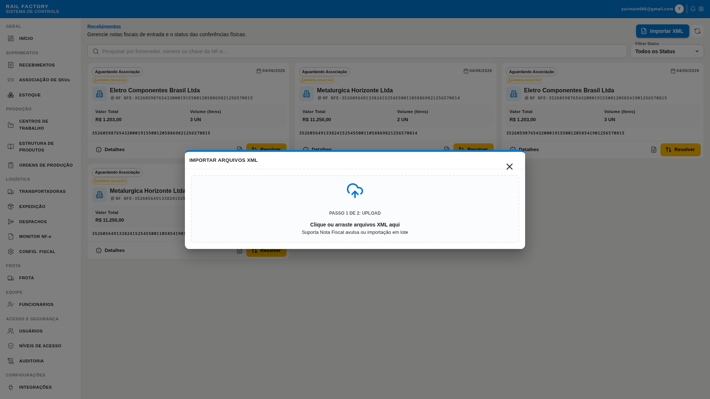

*Workbench de Associação de SKUs:*
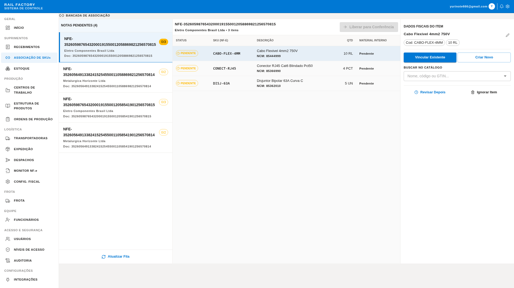

### 📖 Passo a Passo de Operação (Operador)
1. **Importação do Arquivo:** Acesse a tela de **Recebimentos** (`/app/receipts`). No topo da página, clique no botão **"IMPORTAR XML"**.
2. **Seleção da Nota:** Uma gaveta lateral se abrirá. Clique na área pontilhada para selecionar o arquivo `.xml` da nota fiscal emitida pelo fornecedor e confirme.
3. **Identificação de SKU Pendente:** A nota importada aparecerá listada. Se houver itens na nota cujos códigos do fornecedor nunca foram associados aos seus códigos internos, o status da nota mostrará um indicador visual pendente.
4. **Associação do SKU:** Clique no botão **"Associar SKU"** (na coluna Ações). Você será redirecionado ao Workbench de Associação.
5. **Configuração do Vínculo:** No Workbench, selecione o material equivalente no seu catálogo interno e digite o **Fator de Conversão** (Exemplo: se o fornecedor vendeu em "CX" (caixa) com 100 unidades e você controla o estoque em "UN" (unidades), digite o fator `100.00`).
6. **Finalização:** Clique no botão **"Confirmar Associação"**. O vínculo é salvo e a nota fiscal é atualizada e liberada para o fluxo de conferência física.

### ❓ Dúvidas Comuns & Resolução de Problemas
- **O material correspondente ainda não está cadastrado no meu catálogo. O que fazer?**
  - *Resolução:* No próprio Workbench de Associação, clique em **"Cadastrar Material"**. O sistema abrirá um formulário para você registrar o material no catálogo geral instantaneamente e já associá-lo, sem precisar sair da tela ou perder o processo.
- **Errei o fator de conversão ao associar. Como corrigir?**
  - *Resolução:* Vá em **Associação de SKUs** no menu, busque pelo fornecedor e pelo SKU e clique em **"Substituir Associação"** (Override). Isso atualizará o fator e as notas subsequentes utilizarão o novo fator de cálculo.

### Mapeamento de UI (Telas, Modais e Botões)
- **Caminho da Página:** `/app/receipts` (Recebimentos) e `/app/supply-chain/association` (Associação de SKUs)
- **Painel lateral (Drawer):** `XMLImportDrawer` (Importar XML de NF-e)
- **Botões e Ações:**
  - Botão **"IMPORTAR XML"** na barra superior da página de Recebimentos.
  - Botão **"Associar SKU"** na coluna Ações da tabela de Notas Fiscais.
  - Botão **"Confirmar Associação"** no Workbench de Associação.

### Diagrama de Sequência
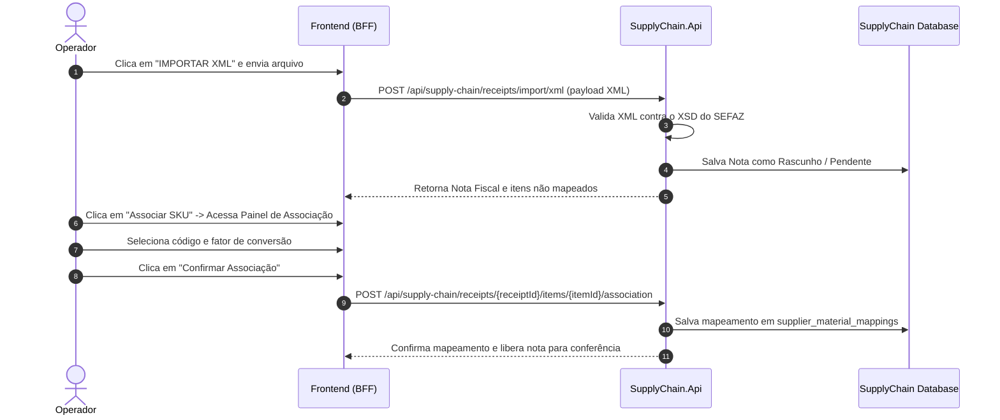

### Arquivos-Chave
- **Frontend UI:** [AssociationWorkbenchPage.tsx](file:///home/levi/Projects/Rail-Factory-Fork/src/RailFactory.Frontend/App/src/features/supply-chain/components/AssociationWorkbenchPage.tsx) | [AssociationWorkspace.tsx](file:///home/levi/Projects/Rail-Factory-Fork/src/RailFactory.Frontend/App/src/features/supply-chain/components/AssociationWorkspace.tsx)
- **Endpoints Backend:** [SupplyChainEndpoints.cs](file:///home/levi/Projects/Rail-Factory-Fork/src/RailFactory.SupplyChain.Api/Api/SupplyChainEndpoints.cs)
- **Domínio:** [Receipt.cs](file:///home/levi/Projects/Rail-Factory-Fork/src/RailFactory.SupplyChain.Api/Domain/Receipt.cs) | [SupplierMaterialMapping.cs](file:///home/levi/Projects/Rail-Factory-Fork/src/RailFactory.SupplyChain.Api/Domain/SupplierMaterialMapping.cs)
- **Mapeador XML:** [BasicXmlNfeProvider.cs](file:///home/levi/Projects/Rail-Factory-Fork/src/RailFactory.SupplyChain.Api/Infrastructure/Services/BasicXmlNfeProvider.cs)

---

## Fluxo 2: Conferência Cega e Confirmação de Saldo (Estoque)

### Descrição
Quando a carga física chega, o operador inicia a Conferência Cega. Ele insere as quantidades recebidas sem conhecer os valores declarados no XML fiscal. Ao fechar a conferência (`CloseConference`), a nota fiscal é aprovada ou marcada como divergente. O sistema publica o evento `supply.receipt_item_conferred` no Outbox, que é propagado via RabbitMQ para o `Inventory.Api` liberar ou bloquear o saldo físico correspondente e registrar o histórico de movimentação (`Ledger`).

### 🖥️ Visual das Telas
*Fila de Recebimento de Notas (Módulo Supply Chain):*
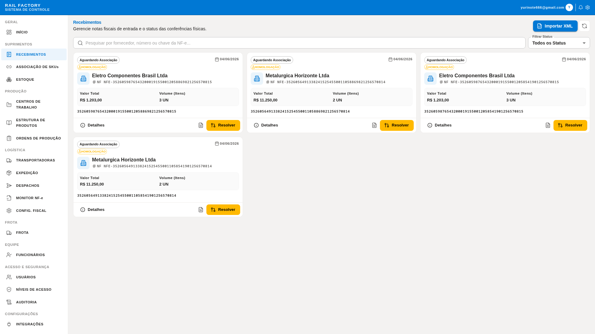

*Saldos no Almoxarifado (Módulo de Estoque):*
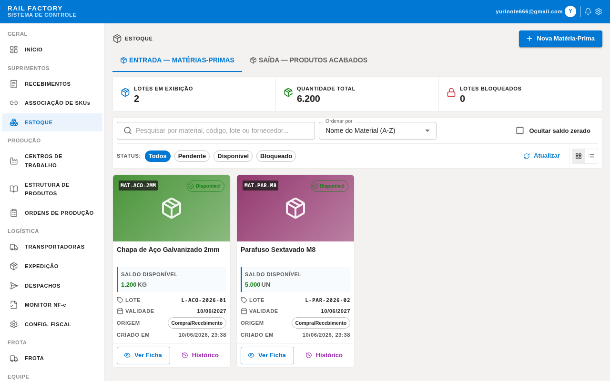

### 📖 Passo a Passo de Operação (Operador)
1. **Entrada de Mercadoria:** Na tela de **Recebimentos** (`/app/receipts`), localize a nota fiscal da carga que chegou e clique no botão **"Iniciar Conferência"**. A nota mudará para o status `Em Conferência`.
2. **Contagem Física:** Conte as caixas e itens fisicamente no pátio ou doca de recebimento.
3. **Apontamento de Quantidades:** Digite no campo **"Quantidade Contada"** o valor exato que você contou para cada um dos itens listados na tela. O sistema omitirá a quantidade declarada no XML fiscal para garantir que não haja contagens viciadas.
4. **Fechamento:** Clique em **"Concluir Conferência"**. O sistema cruzará os dados contados com a nota fiscal original.
5. **Resolução de Saldos:** Se as quantidades baterem, a nota é finalizada como `Approved` e o saldo entra no estoque com status `Available` (Disponível para produção). Se houver divergência, a nota é salva como `Divergent` e os materiais vão para a área de quarentena do estoque com status `Blocked` (Bloqueado) para análise de qualidade.

### ❓ Dúvidas Comuns & Resolução de Problemas
- **Por que a nota fiscal foi marcada como "Divergência" se eu contei o que estava em mãos?**
  - *Resolução:* Isso ocorre se a contagem inserida for menor ou maior que o valor declarado pelo fornecedor na nota fiscal. O saldo divergente é bloqueado no estoque para evitar desvios ou erros de entrada física. O supervisor de logística deve inspecionar a carga e decidir se aceita a entrada parcial ou devolve a mercadoria.
- **Como faço para consultar os históricos das contagens?**
  - *Resolução:* Acesse a tela de **Estoque** (`/app/inventory`), busque pelo lote gerado e clique em **"Histórico"** para ver a transição física originada pela conferência da NF-e.

### Mapeamento de UI (Telas, Modais e Botões)
- **Caminho da Página:** `/app/receipts` (Recebimentos) -> Abre workspace dinâmico de conferência da nota selecionada.
- **Botões e Ações:**
  - Botão **"Iniciar Conferência"** no detalhe da nota com status `Pending`.
  - Input **"Quantidade Contada"** na tabela de itens do workbench de conferência.
  - Botão **"Concluir Conferência"** no canto inferior do workbench.

### Diagrama de Sequência
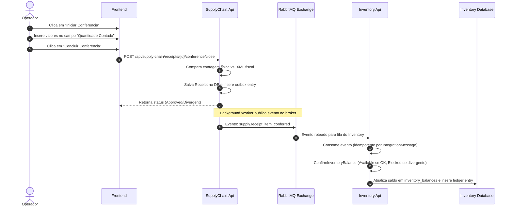

### Arquivos-Chave
- **Frontend UI:** [ConferenceWorkspace.tsx](file:///home/levi/Projects/Rail-Factory-Fork/src/RailFactory.Frontend/App/src/features/supply-chain/components/ConferenceWorkspace.tsx)
- **Endpoints:** [SupplyChainEndpoints.cs](file:///home/levi/Projects/Rail-Factory-Fork/src/RailFactory.SupplyChain.Api/Api/SupplyChainEndpoints.cs) | [InventoryEndpoints.cs](file:///home/levi/Projects/Rail-Factory-Fork/src/RailFactory.Inventory.Api/Api/InventoryEndpoints.cs)
- **Outbox Publisher:** [InventoryPendingBalanceDispatcher.cs](file:///home/levi/Projects/Rail-Factory-Fork/src/RailFactory.SupplyChain.Api/Infrastructure/Integration/InventoryPendingBalanceDispatcher.cs)
- **RabbitMQ Consumer:** [InventoryIntegrationConsumer.cs](file:///home/levi/Projects/Rail-Factory-Fork/src/RailFactory.Inventory.Api/Infrastructure/Integration/InventoryIntegrationConsumer.cs)
- **Domínio Estoque:** [InventoryBalance.cs](file:///home/levi/Projects/Rail-Factory-Fork/src/RailFactory.Inventory.Api/Domain/InventoryBalance.cs) | [InventoryLedgerEntry.cs](file:///home/levi/Projects/Rail-Factory-Fork/src/RailFactory.Inventory.Api/Domain/InventoryLedgerEntry.cs)

---

## Fluxo 3: Engenharia de Produto (BOM, Perda Técnica e Custos)

### Descrição
Engenheiros criam estruturas de produtos (BOM) sob a forma de Rascunho. O cadastro inclui perda técnica (Scrap Factor) e Lote Padrão (Batch Size) para cálculo correto de proporções. Para calcular o Custo Teórico (`GetBomCostRollup`), o microserviço de Produção consulta em tempo real o preço médio histórico no microserviço de SupplyChain através de um endpoint HTTP interno protegido por chave de API.

### 🖥️ Visual das Telas
*Estrutura de Produtos (BOM) - Lista:*
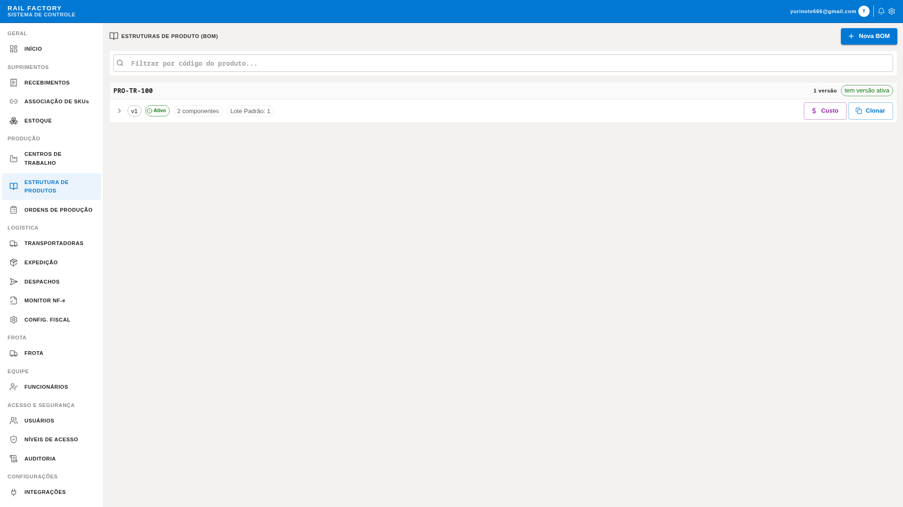

*Custo Teórico Consolidado (BOM Costing Roll-up):*
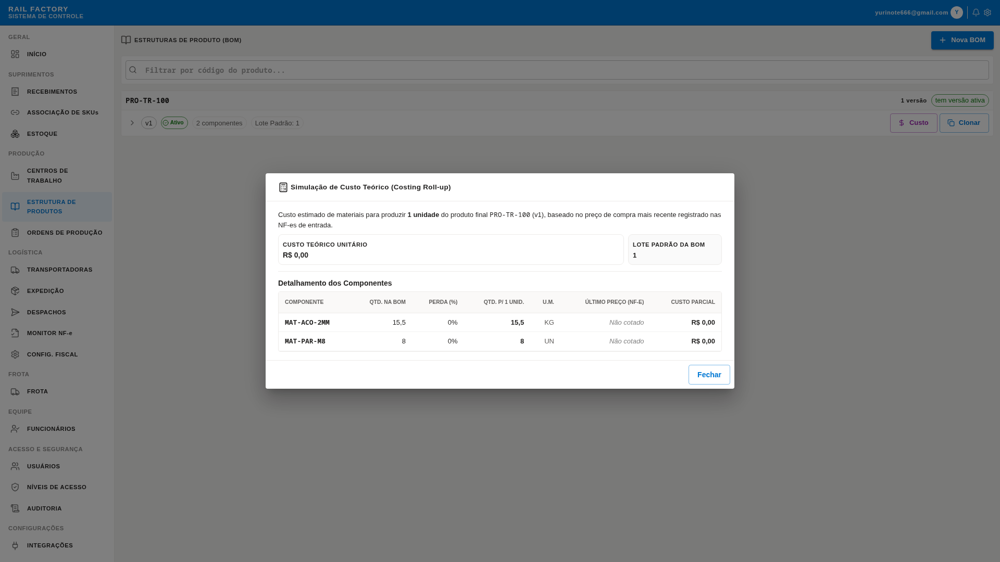

### 📖 Passo a Passo de Operação (Engenheiro)
1. **Criar Estrutura Principal:** Vá na tela **Estrutura de Produtos** (`/app/production/boms`) e clique em **"NOVA ESTRUTURA (BOM)"**.
2. **Definir Lote:** No modal `CreateBomModal`, informe o Código do Produto Acabado que será fabricado e o **Lote Padrão** (Batch Size) da receita (ex: `100.00 kg` se a fórmula render 100kg de massa de poliuretano). Salve.
3. **Adicionar Componentes:** Clique no botão **"Adicionar Componente"** dentro do card criado (ainda em rascunho).
4. **Fator de Perda Técnica:** No modal `AddBomItemModal`, selecione o insumo e informe a quantidade líquida exigida para o Lote Padrão e o **Fator de Perda Técnica** (ex: `5%` para prever reações ou restos na tubulação). Salve.
5. **Auditar Custo Teórico:** Clique no botão **"Custo"** (ícone de moeda BRL). O sistema abrirá o modal `BomCostRollupModal` detalhando a soma dos custos de todos os componentes reajustados pelo fator de perda.
6. **Ativar Receita:** Se tudo estiver correto, clique em **"Ativar"**. Isso mudará a receita para o status `Active` e arquivará automaticamente as versões anteriores.

### ❓ Dúvidas Comuns & Resolução de Problemas
- **O que significa o "Lote Padrão" no cálculo de materiais?**
  - *Resolução:* Significa que se o seu Lote Padrão for 10 unidades e um componente tiver quantidade = 2, o sistema sabe que a relação é de 0,2 componentes por produto acabado. Quando uma Ordem de Produção for aberta para 50 unidades, o sistema solicitará automaticamente 10 componentes.
- **Por que o botão de "Custo" exibe itens com valor zerado?**
  - *Resolução:* Se um insumo nunca foi importado via XML de NF-e na plataforma, não haverá registro de preço de compra no `SupplyChain.Api`. Nesse caso, o custo teórico do insumo é considerado zero. Faça uma importação de nota para esse material para gerar a base histórica.

### Mapeamento de UI (Telas, Modais e Botões)
- **Caminho da Página:** `/app/production/boms` (Estrutura de Produtos)
- **Modais:**
  - `CreateBomModal` (Criar Nova Estrutura)
  - `AddBomItemModal` (Adicionar Componente)
  - `BomCostRollupModal` (Custo Teórico do Produto)
- **Botões e Ações:**
  - Botão **"NOVA ESTRUTURA (BOM)"** na barra superior da página.
  - Botão **"Adicionar Componente"** no card de uma BOM rascunho.
  - Botão **"Clonar"** no cabeçalho do card de BOM.
  - Botão **"Custo"** no rodapé do card de BOM.
  - Botão **"Ativar"** no cabeçalho do card de BOM.

### Diagrama de Sequência
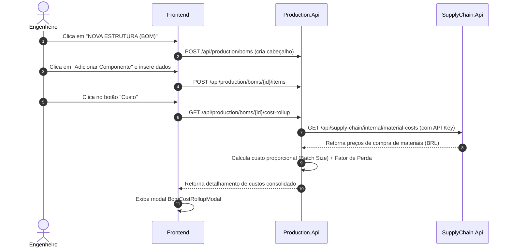

### Arquivos-Chave
- **Frontend UI:** [BomsPage.tsx](file:///home/levi/Projects/Rail-Factory-Fork/src/RailFactory.Frontend/App/src/features/production/components/BomsPage.tsx) | [BomCostRollupModal.tsx](file:///home/levi/Projects/Rail-Factory-Fork/src/RailFactory.Frontend/App/src/features/production/components/BomCostRollupModal.tsx)
- **Domínio BOM:** [BillOfMaterials.cs](file:///home/levi/Projects/Rail-Factory-Fork/src/RailFactory.Production.Api/Domain/BillOfMaterials.cs) | [BomItem.cs](file:///home/levi/Projects/Rail-Factory-Fork/src/RailFactory.Production.Api/Domain/BomItem.cs)
- **Use Case:** [GetBomCostRollup.cs](file:///home/levi/Projects/Rail-Factory-Fork/src/RailFactory.Production.Api/Application/Boms/GetBomCostRollup.cs)
- **Client HTTP Interno:** [HttpMaterialCostProvider.cs](file:///home/levi/Projects/Rail-Factory-Fork/src/RailFactory.Production.Api/Infrastructure/Adapters/Costing/HttpMaterialCostProvider.cs)

---

## Fluxo 4: Execução de Produção (Reserva, Consumo e Qualidade)

### Descrição
Uma Ordem de Produção (OP) é criada no estado `Draft`. Ao liberá-la (`Release`), a integridade da BOM ativa e do Work Center ativo são verificados. O sistema gera uma reserva de estoque enviando o evento `production.stock_reservation_requested` para o microserviço de Estoque. Durante a produção física, o operador aponta insumos consumidos, refugos (scrap) e realiza inspeção de qualidade para concluir e gerar o produto final.

### 🖥️ Visual das Telas
*Lista de Ordens de Produção (Estados Draft/Released/InExecution):*
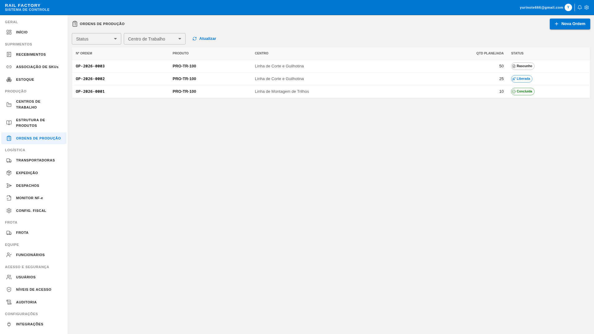

### 📖 Passo a Passo de Operação (Operador de Fábrica)
1. **Abrir Ordem:** Na tela **Ordens de Produção** (`/app/production/orders`), clique no botão **"NOVA ORDEM"**.
2. **Definir Planejamento:** No modal `CreateProductionOrderModal`, selecione o Produto Acabado, digite a quantidade que deseja fabricar e o Centro de Trabalho (Máquina/Linha) onde a fabricação ocorrerá. Salve. A ordem entra como `Draft` (Rascunho).
3. **Liberar Carga:** Clique no botão **"Liberar"** no card da OP. O sistema verificará se a BOM do produto e o Centro de Trabalho estão ativos e publicará uma solicitação de reserva. O estoque mudará a quantidade necessária de `Available` para `Reserved` para garantir que o material não seja desviado. A ordem transiciona para `Released`.
4. **Iniciar Execução:** Quando a produção física iniciar na máquina, clique em **"Iniciar"**. O status mudará para `InExecution`.
5. **Apontar Consumo:** Conforme a matéria-prima é consumida, clique em **"Consumir"** para abrir o modal `ConsumeMaterialModal`. Insira o lote do insumo que foi recolhido do estoque e a quantidade utilizada.
6. **Inspeção de Qualidade:** Ao final da produção, o inspetor clica em **"Inspecionar"**. No modal `QualityInspectionModal`, registre quantas peças foram aprovadas e rejeitadas.
7. **Fechar Processo:** Clique em **"Concluir"**. A OP é finalizada, e o saldo do produto acabado é adicionado ao estoque (`Available`).

### ❓ Dúvidas Comuns & Resolução de Problemas
- **Por que a liberação da OP deu erro e não gerou a reserva?**
  - *Resolução:* O estoque pode estar sem saldo suficiente dos insumos para cobrir as quantidades planejadas. O sistema impede a liberação de OPs sem matéria-prima física para evitar paradas não planejadas de fábrica. Providencie a compra ou o recebimento de mais insumos.
- **Posso concluir uma OP que teve peças reprovadas?**
  - *Resolução:* Sim. O sistema aceita o registro de refugos no apontamento de qualidade e a OP pode ser concluída. Apenas a quantidade aprovada entrará no saldo do estoque disponível.

### Mapeamento de UI (Telas, Modais e Botões)
- **Caminho da Página:** `/app/production/orders` (Ordens de Produção)
- **Modais:**
  - `CreateProductionOrderModal` (Abrir Ordem de Produção)
  - `ConsumeMaterialModal` (Registrar Consumo de Material)
  - `QualityInspectionModal` (Apontar Inspeção de Qualidade)
- **Botões e Ações:**
  - Botão **"NOVA ORDEM"** no topo da página.
  - Botão **"Liberar"** na OP rascunho (`Draft`).
  - Botão **"Iniciar"** na OP liberada (`Released`).
  - Botão **"Consumir"** na OP em execução (`InExecution`).
  - Botão **"Inspecionar"** na OP em execução.
  - Botão **"Concluir"** na OP em execução com inspeção registrada.
  - Botão **"Cancelar"** nas OPs elegíveis.

### Diagrama de Sequência
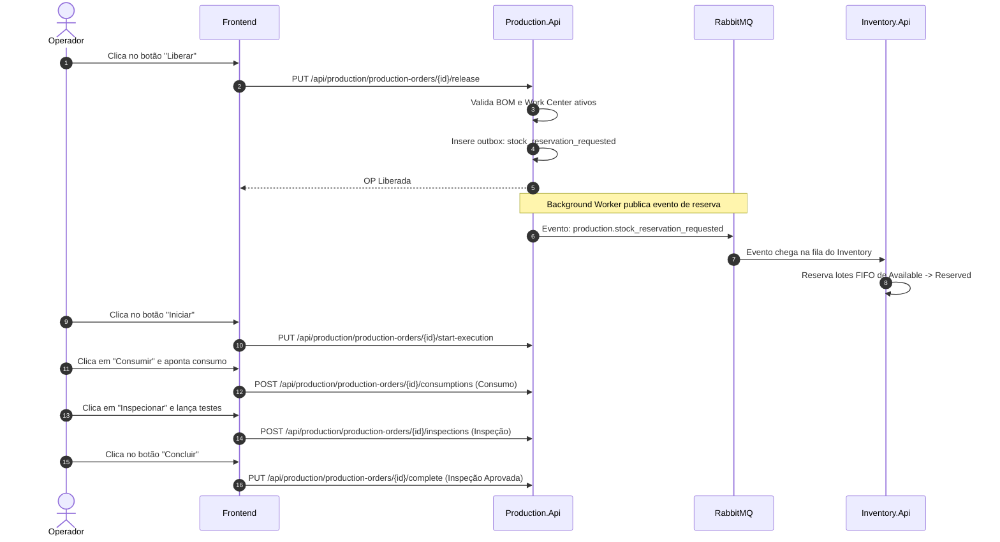

### Arquivos-Chave
- **Frontend UI:** [ProductionOrdersPage.tsx](file:///home/levi/Projects/Rail-Factory-Fork/src/RailFactory.Frontend/App/src/features/production/components/ProductionOrdersPage.tsx)
- **Domínio OP:** [ProductionOrder.cs](file:///home/levi/Projects/Rail-Factory-Fork/src/RailFactory.Production.Api/Domain/ProductionOrder.cs) | [WorkCenter.cs](file:///home/levi/Projects/Rail-Factory-Fork/src/RailFactory.Production.Api/Domain/WorkCenter.cs)
- **Use Case:** [ReleaseProductionOrder.cs](file:///home/levi/Projects/Rail-Factory-Fork/src/RailFactory.Production.Api/Application/Orders/ReleaseProductionOrder.cs)
- **Outbox Publisher:** [ProductionInventoryDispatcher.cs](file:///home/levi/Projects/Rail-Factory-Fork/src/RailFactory.Production.Api/Infrastructure/Integration/ProductionInventoryDispatcher.cs)

---

## Fluxo 5: Expedição, Despacho (Carga) e Baixa de Estoque

### Descrição
Materiais acabados e faturados são organizados em Ordens de Expedição. Para despachar o caminhão, o operador cria um `Dispatch` contendo a transportadora, placa do veículo, RNTRC e CPF do motorista. Ao autorizar o despacho (`ShipDispatch`), o sistema congela esses dados cadastrais na Nota de Transporte, gera o evento de baixa definitiva de estoque `logistics.shipment_dispatched` e aciona a emissão de MDF-e fiscal.

### 🖥️ Visual das Telas
*Montagem e Cadastro de Novo Despacho:*
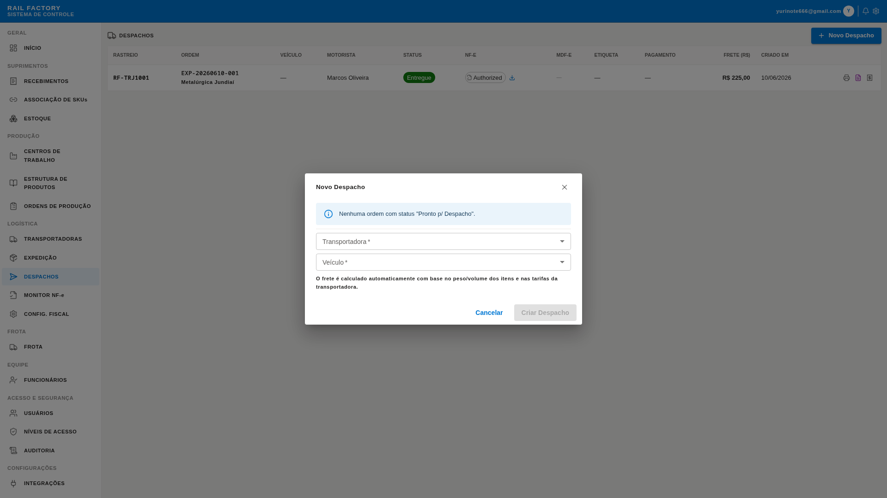

*Ordens de Expedição Faturadas:*
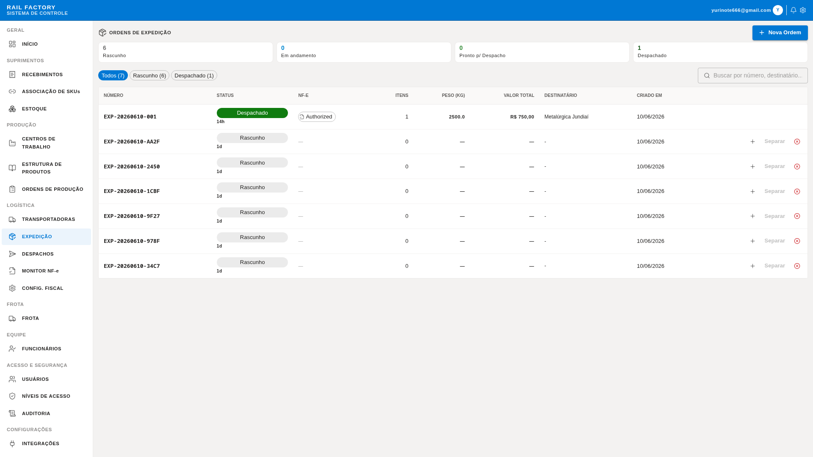

### 📖 Passo a Passo de Operação (Logística/Expedição)
1. **Visualizar Ordens:** Verifique as cargas faturadas prontas na tela **Ordens de Expedição** (`/app/logistics/shipment-orders`).
2. **Montar Caminhão:** Acesse a tela **Despachos** (`/app/logistics/dispatches`) e clique em **"NOVO DESPACHO"**.
3. **Preencher Dados de Carga:** No modal `CreateDispatchModal`, selecione a Transportadora contratada, as Ordens de Expedição correspondentes, o Veículo da frota (o sistema carrega a placa e RNTRC) e o Motorista responsável (o sistema carrega o CPF). Salve.
4. **Liberar Portão:** Quando o veículo estiver carregado e pronto para a viagem, clique no botão **"Expedir"**. O sistema alterará o status para `Shipped` (Enviado), congelando os dados fiscais e publicando a baixa no estoque. O `Inventory.Api` remove os produtos permanentemente da quantidade `Available`.
5. **Imprimir Guia:** Clique no botão **"Imprimir DAMDFE"** para abrir o espelho do manifesto de carga em formato PDF A4 para entregar ao motorista.
6. **Entrega no Destino:** Quando a transportadora confirmar a entrega, localize o despacho na tabela e clique em **"Entregar"** para finalizar a transação (`Delivered`).

### ❓ Dúvidas Comuns & Resolução de Problemas
- **Por que a placa ou motorista não aparece na lista de seleção?**
  - *Resolução:* O veículo precisa estar ativo com o número do registro RNTRC preenchido (módulo Frota) e o motorista precisa estar com o cadastro de CPF regularizado e ativo (módulo Funcionários) para aparecerem como opções elegíveis de transporte.
- **Onde encontro o código para o rastreamento externo do cliente?**
  - *Resolução:* No card do despacho expedido, copie a chave de rastreamento (ex: `RF-TRJ1001`). O cliente pode colar esse código na página de login/consulta pública da empresa para ver o status da viagem sem precisar logar.

### Mapeamento de UI (Telas, Modais e Botões)
- **Caminho da Página:** `/app/logistics/dispatches` (Despachos)
- **Modais:**
  - `CreateDispatchModal` (Criar Novo Despacho)
- **Botões e Ações:**
  - Botão **"NOVO DESPACHO"** no topo da página.
  - Botão **"Expedir"** no despacho com status pendente (`Pending`).
  - Botão **"Entregar"** no despacho expedido (`Shipped`).
  - Botão **"Imprimir DAMDFE"** no despacho `Shipped` ou `Delivered`.

### Diagrama de Sequência
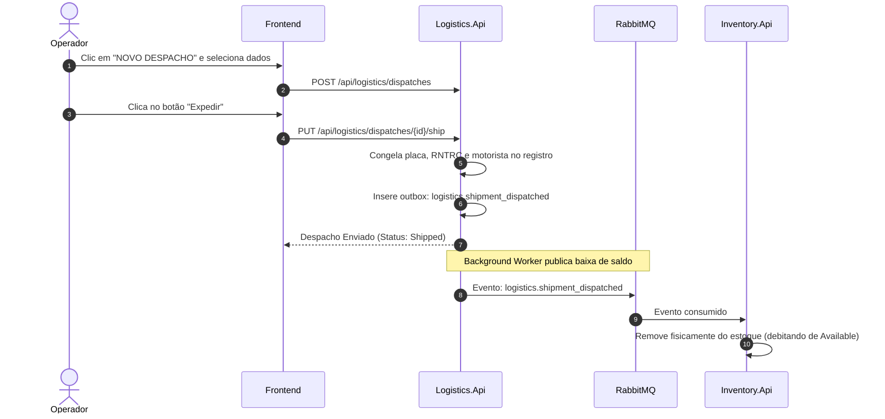

### Arquivos-Chave
- **Frontend UI:** [DispatchPage.tsx](file:///home/levi/Projects/Rail-Factory-Fork/src/RailFactory.Frontend/App/src/features/logistics/components/DispatchPage.tsx) | [DamdfePrintView.tsx](file:///home/levi/Projects/Rail-Factory-Fork/src/RailFactory.Frontend/App/src/features/logistics/components/DamdfePrintView.tsx)
- **Domínio Logística:** [Dispatch.cs](file:///home/levi/Projects/Rail-Factory-Fork/src/RailFactory.Logistics.Api/Domain/Dispatch.cs) | [ShipmentOrder.cs](file:///home/levi/Projects/Rail-Factory-Fork/src/RailFactory.Logistics.Api/Domain/ShipmentOrder.cs)
- **Outbox Publisher:** [LogisticsInventoryDispatcher.cs](file:///home/levi/Projects/Rail-Factory-Fork/src/RailFactory.Logistics.Api/Infrastructure/Integration/LogisticsInventoryDispatcher.cs)
- **Outbox Fiscal (MDF-e):** [LogisticsFiscalDispatcher.cs](file:///home/levi/Projects/Rail-Factory-Fork/src/RailFactory.Logistics.Api/Infrastructure/Integration/LogisticsFiscalDispatcher.cs)

---

## Fluxo 6: Notificações de Webhooks de Transportadoras

### Descrição
Sempre que um despacho tem alteração de estado (expedido ou entregue), se a transportadora parceira cadastrou um endpoint de webhook no sistema, um evento do tipo `webhook_notification` é salvo no Outbox. O `LogisticsWebhookDispatcher` lê essas requisições periodicamente e envia atualizações HTTP via POST com controle de idempotência (`X-Idempotency-Key`) e políticas de retentativa exponenciais.

### 🖥️ Visual das Telas
*Cadastro de Webhook no Modal de Transportadora:*
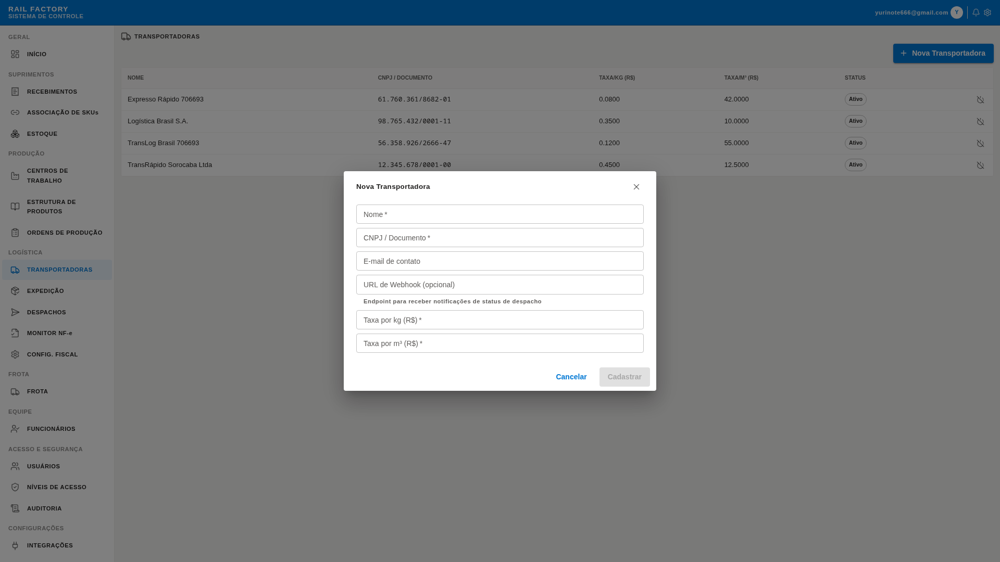

### 📖 Passo a Passo de Operação (Operador de Transporte)
1. **Acessar Cadastro:** Vá na tela **Transportadoras** (`/app/logistics/carriers`) e clique em **"NOVA TRANSPORTADORA"** (ou edite uma existente).
2. **Definir Endpoint:** No modal `CreateCarrierModal`, localize o campo **"URL de Webhook (opcional)"**. Insira a URL do sistema da transportadora parceira onde as atualizações fiscais de tráfego devem ser enviadas (ex: `https://api.parceiro.com.br/webhook`). Salve.
3. **Disparo Automático:** Nenhuma ação manual do operador é necessária após isso. Toda vez que um caminhão da transportadora sair do pátio ou a entrega for concluída, o Logistics Dispatcher disparará a carga de dados no webhook de forma assíncrona.

### ❓ Dúvidas Comuns & Resolução de Problemas
- **O que acontece se o servidor da transportadora parceira estiver instável?**
  - *Resolução:* O sistema conta com uma política de retentativa imutável. Se a transportadora responder com erro (HTTP 500, Timeout, etc.), o despachante de webhooks fará **até 10 tentativas** com espaçamento exponencial. Se a falha persistir, a notificação vai para o banco de dados como falha definitiva (*Dead Letter*) para análise técnica, sem travar o sistema.

### Mapeamento de UI (Telas, Modais e Botões)
- **Caminho da Página:** `/app/logistics/carriers` (Transportadoras)
- **Modais:**
  - `CreateCarrierModal` (Cadastrar Transportadora)
- **Botões e Ações:**
  - Botão **"NOVA TRANSPORTADORA"** no topo da página.
  - Botão **"Salvar"** no rodapé do modal de cadastro.

### Diagrama de Sequência
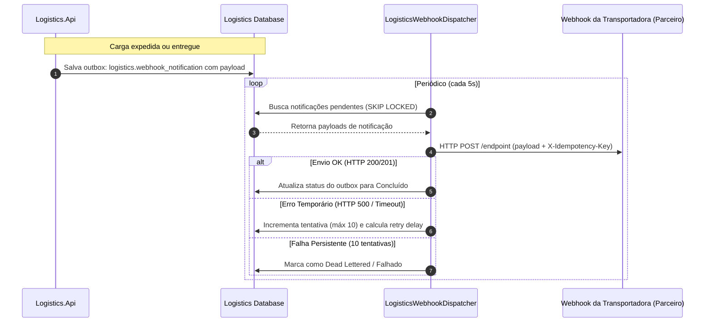

### Arquivos-Chave
- **Cadastro na UI:** [CreateCarrierModal.tsx](file:///home/levi/Projects/Rail-Factory-Fork/src/RailFactory.Frontend/App/src/features/logistics/components/CreateCarrierModal.tsx)
- **Domínio:** [Carrier.cs](file:///home/levi/Projects/Rail-Factory-Fork/src/RailFactory.Logistics.Api/Domain/Carrier.cs)
- **Worker de Webhooks:** [LogisticsWebhookDispatcher.cs](file:///home/levi/Projects/Rail-Factory-Fork/src/RailFactory.Logistics.Api/Infrastructure/Integration/LogisticsWebhookDispatcher.cs)

---

## Fluxo 7: Trilha de Auditoria IAM e Sessões

### Descrição
Para assegurar a rastreabilidade (compliance e segurança), toda operação crítica que afeta as identidades do tenant (como criação de novas sessões e atribuição/revogação de papéis) é gravada na tabela imutável `iam_audit_entries`. O sistema captura de forma segura o endereço IP do requisitante, o CorrelationId da transação HTTP e os e-mails dos envolvidos.

### 🖥️ Visual das Telas
*Histórico Imutável de Eventos e IP de Acesso:*
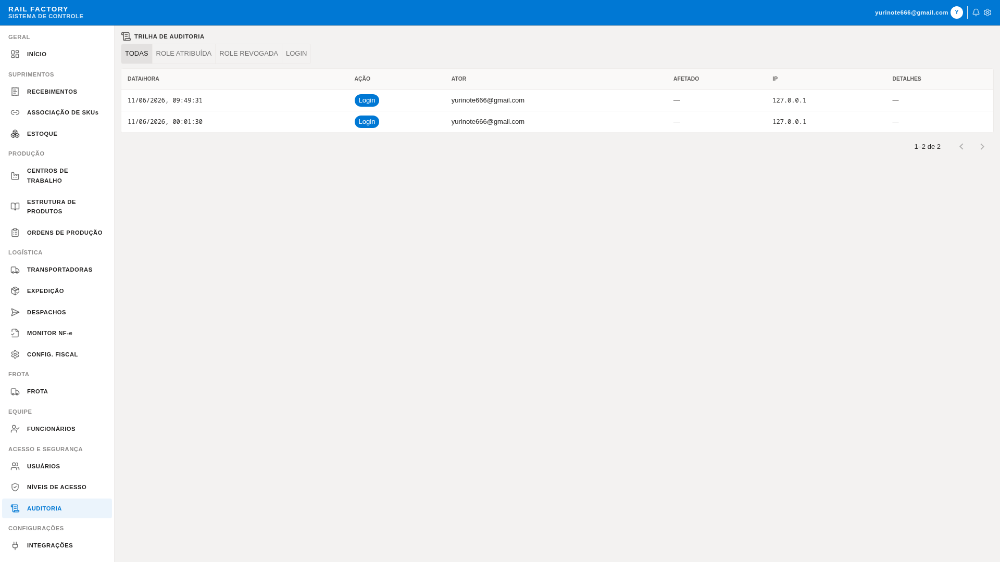

### 📖 Passo a Passo de Operação (Administrador)
1. **Acessar Trilha:** Acesse a tela **Auditoria** (`/app/iam/audit`).
2. **Filtrar Eventos:** Use o menu superior de filtros rápidos (botões de toggle) para selecionar o tipo de evento que deseja pesquisar:
   - Clique em **"TODOS"** para ver todo o log.
   - Clique em **"LOGIN"** para ver quem acessou a plataforma e de qual endereço IP.
   - Clique em **"CARGO ATRIBUÍDO"** ou **"CARGO REVOGADO"** para auditar alterações nas permissões de usuários (RBAC).
3. **Histórico Temporal:** Analise a linha do tempo (timeline) contendo o operador que realizou a ação, o usuário afetado, a data e hora exata e o número de rastreamento exclusivo (CorrelationId) do log.

### ❓ Dúvidas Comuns & Resolução de Problemas
- **Por que vejo o endereço IP de proxy (ex: ngrok ou localhost) nos logs?**
  - *Resolução:* O sistema é configurado para obter o IP encaminhado pelo proxy (`X-Forwarded-For`). Em ambiente de testes local ou sob conexões tuneladas, os endereços registrados refletirão a infraestrutura do proxy local. Em produção real, o IP público e verdadeiro do operador é extraído de forma imutável.

### Mapeamento de UI (Telas, Modais e Botões)
- **Caminho da Página:** `/app/iam/audit` (Auditoria)
- **Botões e Ações:**
  - Filtro **Ação** no topo da página de auditoria.
  - Paginação da Tabela no rodapé do histórico.

### Diagrama de Sequência
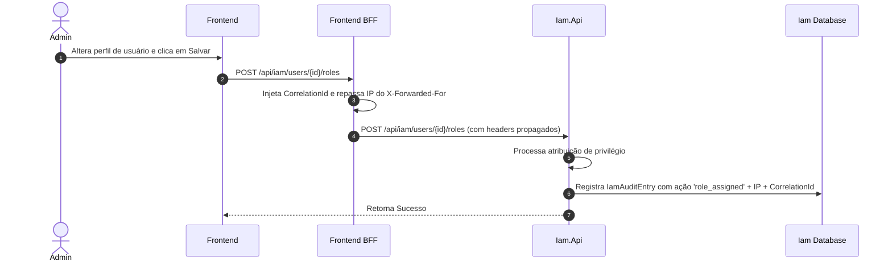

### Arquivos-Chave
- **Frontend UI:** [AuditPage.tsx](file:///home/levi/Projects/Rail-Factory-Fork/src/RailFactory.Frontend/App/src/features/iam/components/AuditPage.tsx)
- **Domínio:** [IamAuditEntry.cs](file:///home/levi/Projects/Rail-Factory-Fork/src/RailFactory.Iam.Api/Domain/IamAuditEntry.cs)
- **Mapeador EF:** [IamDbContext.cs](file:///home/levi/Projects/Rail-Factory-Fork/src/RailFactory.Iam.Api/Infrastructure/Persistence/IamDbContext.cs)
- **Filtro de Log:** [FrontendEndpoints.cs (Propagação de Headers)](file:///home/levi/Projects/Rail-Factory-Fork/src/RailFactory.Frontend/Api/FrontendEndpoints.cs)
